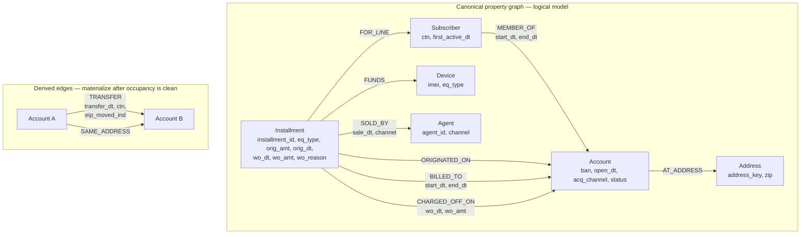

# AT&T Equipment Write-Off Investigation

## Graph-based historical analysis of subscriber transfers and bad debt

**Status:** Design approved for local batch execution  
**Mode:** Historical investigation (not real-time scoring)  
**Compute:** Local workstation  
**Store:** Existing DuckDB extract (`.duckdb`)  
**Graph runtime:** rustworkx + NetworKit (not Neo4j, not DuckPGQ)

---

## 1. Purpose

Equipment write-offs are up year over year. Service write-offs are flat. Credit-policy loosening has already been ruled out.

The working hypothesis is that Transfer of Billing Responsibility (TBR) and related subscriber movements are concentrating unpaid equipment installment liability onto destination accounts. Some of that activity is ordinary (family add, legitimate TBR). Some of it is structured: a line with history is moved onto another BAN, new equipment is added, and the destination account later charges off.

This project uses a property-graph model and a short list of graph algorithms to:

1. Measure whether transfer-linked accounts explain the *increase* in equipment write-off dollars.
2. Reconstruct installment lineage (origin BAN → transfers → charge-off BAN).
3. Find hubs (senders, receivers, intermediaries) and rings (shared address / repeated agent).
4. Separate ordinary household movement from anomalous paths.

The output is an attribution of year-over-year equipment write-off dollars, plus a ranked review list. It is not a production fraud engine.

---

## 2. Problem framing

### Entities

| Business object | Graph object | Key you have |
|---|---|---|
| Wireless account | `Account` | BAN |
| Line / device service | `Subscriber` | CTN / subscriber ID |
| Equipment installment | `Installment` | Installment agreement ID |
| Handset / watch / tablet | `Device` (optional) | IMEI / serial when present |
| Sales origin | `Agent` | Agent ID + channel |
| Household proxy | `Address` | Normalized address + ZIP |

A subscriber belongs to one account at a time. A subscriber can appear on multiple BANs over time. That occupancy history is the source of truth for transfers. You do not have SSN or driver’s license; identity linkage is limited to account attributes, address/ZIP, and operational keys.

### Why equipment can move independently of service loss

Public TBR rules allow a device installment plan to be paid off **or transferred with the line**. Accessory installment plans generally must be paid off and do not transfer. The receiving owner assumes transferred installment plans after a credit check. That is why equipment write-offs can rise while service write-offs stay flat: incremental loss is unpaid device principal, not monthly service.

### What “half-counts” are treated as

Accounts or lines whose history is split across BANs — a CTN with more than one BAN over the analysis window — including family-add and TBR cases.

---

## 3. Assumptions (explicit)

Use these unless a field audit contradicts them.

1. **Keys available:** BAN, CTN, installment ID, equipment type, IMEI when present, occupancy dates, transfer inferred from multi-BAN CTN history, channel, sales agent, billing/service address and ZIP. No SSN or DL.
2. **Write-off grain:** Equipment write-off sits on the installment (amount, date, reason) with BAN and CTN at charge-off. Service write-off sits at BAN (or BAN-month) and is the control series.
3. **Transfer event:** One directed edge `from_ban → to_ban` on a given `ctn` at `transfer_dt` when occupancy ends on A and starts on B. Finer transfer-type codes, if present, are edge attributes.
4. **Installment movement:** An installment may stay on the origin BAN, move with the CTN, or be originated after the inbound transfer. That three-way split is the core attribution cut.
5. **Window:** 36 months of events. Year-over-year comparison is the last 12 months of equipment write-off dollars versus the prior 12 months.
6. **Channel:** Channel and agent are available on the original equipment sale and on any post-transfer add.
7. **Scope:** Consumer wireless extract already loaded into DuckDB. Analysis is batch and local.

---

## 4. Strategy

### Principle

One storage model. Four algorithm projections. Dollar attribution in SQL.

Graph algorithms find structure. They do not, by themselves, explain a finance variance. Every flagged family, hub, or community must be rolled to equipment write-off dollars and compared year over year.

### Sequence (do not skip measurement)

1. **Measure** — Are transfer-linked account families over-represented in the *increase*?
2. **Explain paths** — Which path type holds the new dollars: moved EIP vs new EIP after transfer?
3. **Find concentrators** — Which BANs, agents, or addresses sit on many of those paths?
4. **Find rings** — Which communities share transfers and address structure beyond a single family add?
5. **Only then** — Similarity watchlist for still-open BANs.

### Stop-go rule

If transfer-linked families do not explain most of the year-over-year *increase*, TBR is not the main story. Continue phases 2–4 only as residual checks (product mix, channel, origination quality).

### What this project will not do

- Real-time scoring or case-management workflow
- Neo4j or any server graph database
- DuckPGQ on DuckDB 2.0 (not available on the 2.0 alpha; insufficient algorithm coverage even on versions where it loads)
- NetworkX as the compute engine
- Person/SSN nodes, “fraudster” labels, or invented identity resolution
- Coloring, MST, matching, TSP, or other algorithm families that do not answer this question

---

## 5. Graph model

Transfers are **derived** from occupancy. Do not invent a Transfer event node you cannot key.

### Canonical nodes and relationships



### Field rules

- `MEMBER_OF` is the source of truth for line movement.
- `BILLED_TO` is separate because installment liability can diverge from line occupancy.
- `CHARGED_OFF_ON` points at the BAN that took the equipment loss. Dollars live on the installment.
- `Address` is the household/ring proxy in the absence of SSN. `SAME_ADDRESS` is derived from a normalized `address_key` / ZIP.
- `Agent` attaches to the **sale of the installment**, not to the account.
- `Device` exists only so IMEI reuse is visible. If IMEI is sparse, keep `eq_type` on `Installment` and drop `Device`.

### Algorithm projections

Do not store four graphs. Project from the same edge tables.

| Projection | Edges | Algorithms |
|---|---|---|
| P1 Connectivity | Account — TRANSFER — Account (undirected) | Union-find / WCC |
| P2 Lineage | Installment → Subscriber → MEMBER_OF / BILLED_TO → Account, plus TRANSFER | SQL walk + BFS hop count |
| P3 Centrality | Account → TRANSFER → Account (directed; weight = CTN count or later WO $) | Degree, PageRank, betweenness |
| P4 Communities | TRANSFER + SAME_ADDRESS (optional agent path) | Leiden / ParallelLeiden |

---

## 6. Architecture

### Decision (vetted)

DuckDB 2.0 does **not** currently have a usable graph extension. DuckPGQ is a research SQL/PGQ extension. Official DuckDB docs say it is not available on 1.5.x and to use v1.4.4 if you want it. The DuckPGQ maintainer stated it is not available on 2.0 alpha builds and would follow an official 2.0 release. DuckPGQ also does not provide Leiden or a complete centrality suite, and graph functions have had known failures.

Downgrading the only copy of a 2.0 `.duckdb` file to chase DuckPGQ is the wrong trade: storage compatibility risk, still-incomplete algorithms.

**Keep DuckDB as the OLAP store and feature factory. Run graph algorithms in compiled in-memory libraries. Write scores back to DuckDB.**

```text
.duckdb extract (read source tables)
        │
        ▼
DuckDB SQL
  MEMBER_OF windows
  derived TRANSFER edges
  BILLED_TO / CHARGED_OFF facts
  dense integer node maps
        │
        ▼
Parquet edge lists + node maps
        │
        ├─ rustworkx (Rust)       WCC, BFS/DFS, degree, PageRank, betweenness
        └─ networkit (C++/OpenMP) ParallelLeiden
        │
        ▼
score tables (Parquet) joined back in DuckDB
        │
        ▼
YoY equipment write-off decomposition
```

### Runtime stack

| Layer | Tool | Role |
|---|---|---|
| Store | DuckDB (whatever version stably opens the file) | Source tables, feature SQL, dollar rollups |
| Interchange | Parquet / Arrow | Version-safe extracts; do not treat the `.duckdb` file as portable across major versions |
| Structural graph | rustworkx | WCC, paths, PageRank, betweenness, degrees |
| Communities | networkit | ParallelLeiden |
| Tabular | Polars or pandas | Glue only |

Compatibility rule: if the 2.0 Python client is unstable, export tables to Parquet and run SQL against those files from a stable DuckDB 1.5.x client. Parquet is the compatibility layer.

### What not to introduce

- Neo4j
- NetworkX as the engine (debug sketches only)
- A custom petgraph crate unless rustworkx is missing a required algorithm that networkit also lacks
- Union-find implemented only in recursive SQL as the primary WCC path

---

## 7. Algorithms and why each is used

| Phase | Family | Algorithm | Question it answers |
|---|---|---|---|
| 1 | Connectivity | WCC / union-find on TRANSFER | Is the YoY increase inside transfer families? |
| 2 | Traversal | SQL lineage + BFS hop count | Which path type holds the new WO dollars? |
| 3 | Centrality | In/out-degree, PageRank, betweenness (Brandes; filtered graph) | Who collects, sheds, or intermediates liability? |
| 4 | Communities | Leiden / ParallelLeiden | Which rings share transfers and address/agent structure? |
| 5 (optional) | Similarity | Jaccard / neighborhood overlap | Which *open* BANs look like known WO communities? |

Betweenness is the only algorithm likely to be expensive. Compute it on the transfer graph restricted to families that already have equipment write-offs, not on the full national BAN set.

---

## 8. Investigation flags

These are historical features, not production scores.

### Path flags (installment grain)

- Installment originated on BAN A, charged off on BAN B after a transfer
- New EIP opened on B within 30 / 60 / 90 days of an inbound transfer
- CTN hop count ≥ 2 or ≥ 3 before write-off
- Watch / tablet / accessory share of post-transfer adds above peer rate
- Receiving BAN tenure short at inbound transfer, then new high-balance phone EIP

### Hub flags (BAN grain)

- High in-degree and subsequent equipment write-off
- High out-degree and later collections activity on the origin BAN
- Same agent on many inbound transfers *and* post-transfer equipment adds

### Ring flags (community grain)

- Multiple BANs at one address/ZIP exchanging CTNs, then equipment WO
- Community equipment WO rate far above the singleton baseline, service WO near baseline

### Control flags (do not call these fraud by default)

- Shared household-like ZIP, long joint tenure, single inbound transfer, no stacked post-transfer EIP
- Write-off is only an old transferred balance with no new equipment on the destination

The last control row can still be a credit-acceptance issue (taking EIP liability) without being a bad-actor ring.

---

## 9. Year-over-year decomposition

This is the proof step. Equipment write-off dollars, current 12 months vs prior 12 months:

1. Singleton families vs transfer-linked families
2. Transfer-linked: **moved EIP** vs **new EIP after transfer**
3. Equipment type (phone, watch, tablet, other)
4. Channel / agent
5. Hop count (1 vs 2+)
6. Days from last transfer to installment start
7. Community or family size band

### How to read the cells that grew

| If this bucket grew | Interpretation |
|---|---|
| New EIP after transfer | Destination stacking / credit seasoning |
| Moved EIP that later charged off | Liability accepted onto weaker destination BANs |
| One equipment type or one channel | Product or dealer problem riding the TBR path |
| A handful of communities or agents | Concentrated abuse or process failure |
| Transfer-linked share stable; balance per device up | Price / mix, not graph movement |

---

## 10. High-level execution plan

### Phase 0 — Field inventory and extracts (1–2 days)

- Confirm column names for BAN, CTN, installment ID, occupancy dates, WO amount/date, equipment type, IMEI, address, ZIP, channel, agent.
- Snapshot source tables to Parquet beside the `.duckdb` file.
- Define the 36-month event window and the two 12-month WO comparison windows.
- Build a data dictionary for the project.

**Exit:** You can name every field used in `MEMBER_OF`, `BILLED_TO`, and `CHARGED_OFF_ON`.

### Phase 1 — Occupancy and transfer edge list (2–3 days)

In DuckDB:

- Build `subscriber_occupancy(ctn, ban, start_dt, end_dt)`.
- Derive `transfer_edge(from_ban, to_ban, ctn, transfer_dt)`.
- Build `installment_fact` with originated BAN, billed BAN windows, charge-off BAN, WO dollars, equipment type, agent, channel.
- Assign dense integer IDs for BAN and CTN.

**Exit:** Transfer counts, multi-BAN CTN counts, and equipment WO dollars by transfer-linked vs singleton.

### Phase 2 — Measurement (WCC) (1 day)

- Load undirected TRANSFER edges into rustworkx.
- Compute family_id (weakly connected component).
- Join family_id back to installment write-offs.
- Produce the first YoY split: singleton vs transfer-linked.

**Exit:** Stop-go decision on whether TBR families explain the increase.

### Phase 3 — Lineage (2–3 days)

- For every equipment write-off in the two YoY windows, reconstruct:
  - origin BAN, charge-off BAN
  - hop count
  - moved EIP vs new EIP after last transfer
  - days transfer → installment start → delinquency → WO
  - equipment type, channel, agent
- Keep this as an installment-grain table. It is the working dataset for finance review.

**Exit:** Path-type dollar table for both years.

### Phase 4 — Hubs (1–2 days)

- Directed TRANSFER graph in rustworkx.
- In-degree, out-degree, PageRank.
- Betweenness on the write-off-touched subgraph only.
- Rank BANs and agents by WO dollars flowing through them.

**Exit:** Hub list with dollars, not just scores.

### Phase 5 — Communities (1–2 days)

- Build BAN graph with TRANSFER + SAME_ADDRESS.
- Run networkit ParallelLeiden.
- Score each community: equipment WO rate, service WO rate, post-transfer add rate, agent concentration.

**Exit:** Ranked communities for operations review.

### Phase 6 — Synthesis (2–3 days)

- Full YoY pivot (section 9).
- Manual review packet: top communities, top agents, top paths by dollars.
- Written conclusion: supported drivers, rejected drivers, residual unexplained dollars.
- Optional similarity watchlist for open BANs (only if phases 2–5 support the TBR thesis).

**Exit:** Decision memo plus tables. No model deployment.

---

## 11. Suggested physical tables

Create these in DuckDB (or as Parquet datasets). Names can match your warehouse conventions.

| Table | Grain | Minimum columns |
|---|---|---|
| `account` | BAN | ban, open_dt, acq_channel, zip, address_key, status |
| `subscriber` | CTN | ctn, first_active_dt |
| `subscriber_occupancy` | CTN × BAN × interval | ctn, ban, start_dt, end_dt |
| `transfer_edge` | one move | from_ban, to_ban, ctn, transfer_dt, eip_moved_ind |
| `installment_fact` | installment | installment_id, ctn, imei, eq_type, orig_amt, orig_dt, originated_ban, wo_dt, wo_amt, wo_reason, chargeoff_ban, agent_id, channel |
| `installment_billed` | installment × BAN × interval | installment_id, ban, start_dt, end_dt |
| `ban_map` | BAN | ban, ban_idx |
| `ban_family` | BAN | ban, family_id, family_size |
| `ban_centrality` | BAN | ban, in_degree, out_degree, pagerank, betweenness |
| `ban_community` | BAN | ban, community_id, community_size |
| `wo_lineage` | written-off installment | all path attributes in phase 3 |

---

## 12. Deliverables

1. This project document (scope and method).
2. Parquet extracts and the table set in section 11.
3. `wo_lineage` for both YoY windows.
4. YoY decomposition workbook or SQL views.
5. Ranked review lists: families, communities, agents, paths.
6. Short findings memo: what caused the equipment WO increase, what did not, and what should be reviewed operationally.

---

## 13. Risks and controls

| Risk | Control |
|---|---|
| Household TBR labeled as fraud | Control flags; review dollars and new-EIP stacking, not transfer existence |
| DuckDB 2.0 file not portable | Parquet sidecar extracts; never downgrade the only copy in place |
| Betweenness too slow | Restrict to WO-touched transfer subgraph; approximate if needed |
| Address matching over-links apartments / stores | Require normalized address_key; treat high-occupancy ZIPs with care |
| Agent IDs reused across channels | Always pair agent with channel and sale date |
| Incomplete occupancy windows | Audit CTNs with overlapping BAN membership before deriving TRANSFER |

---

## 14. Immediate next step

Build `subscriber_occupancy` and `transfer_edge` from the existing DuckDB tables, then run the singleton vs transfer-linked year-over-year split. That single result decides whether the rest of the graph work is the main investigation or a residual check.
