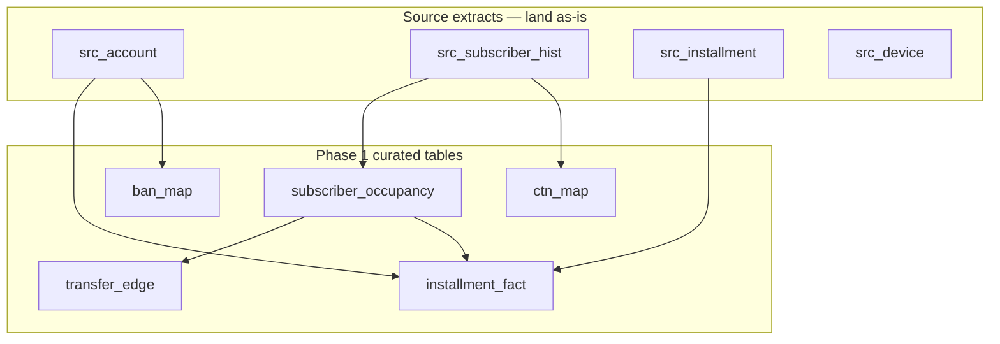
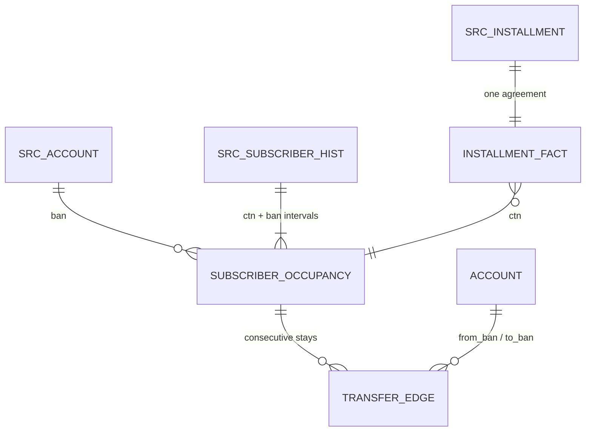
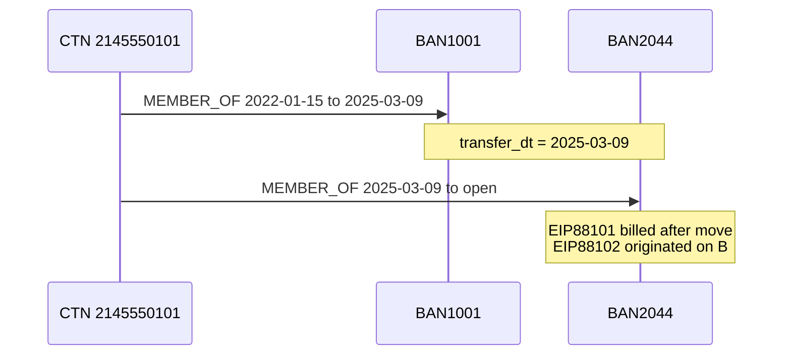
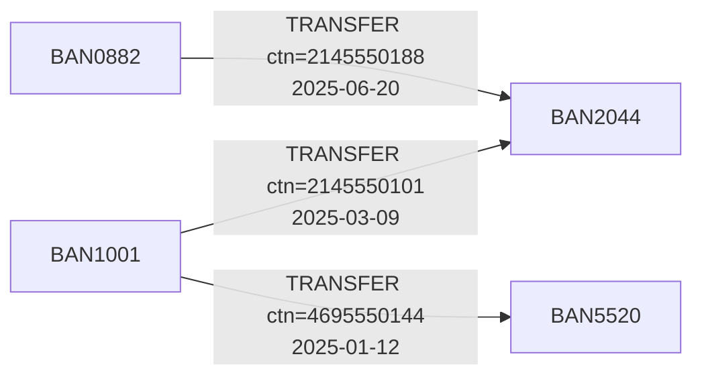

# Phase 1 Walkthrough

## Occupancy windows and transfer edges in DuckDB

**Objective.** Turn the existing flat extracts into a dated occupancy model and a derived BAN-to-BAN transfer edge list. This phase does not run rustworkx or Leiden. It produces the tables every later phase reads.

**Exit criteria.**

- `subscriber_occupancy` has one closed or open interval per CTN–BAN stay.
- `transfer_edge` has one row per CTN move from BAN A to BAN B.
- `installment_fact` can be joined to both.
- You can report: multi-BAN CTN count, transfer count, equipment write-off dollars on transfer-linked vs singleton accounts.

---

## 1. How to think about the starting data

Wireless operational data usually arrives as **wide fact extracts**, not as a graph. That is expected. Do not force the raw files into graph shape. Land them as typed DuckDB tables, then derive occupancy and edges.

Use three grains and do not mix them in one table:

| Grain | Meaning | Typical source extract |
|---|---|---|
| Account-month or account-current | One BAN | Account master, credit, collections |
| Subscriber-month or subscriber-status | One CTN on one BAN at a time | Line / subscriber history |
| Installment / device agreement | One EIP / Next plan | Equipment installment, device sale |

A CTN that moved will appear on **multiple account rows across time**. That is the transfer signal. Do not collapse history to “current BAN only.”

---

## 2. Recommended source tables

Names below are logical. Map them to whatever you already loaded. Keep original column names in a dictionary; alias to these names in views.

### 2.1 `src_account`

Account master. One row per BAN, or one row per BAN as-of snapshot if you only have current state. Prefer a history table if it exists (`src_account_hist`).

| Column | Type | Required | Why |
|---|---|---|---|
| `ban` | VARCHAR | Yes | Account node key |
| `account_open_dt` | DATE | Yes | Tenure at inbound transfer |
| `account_status` | VARCHAR | Yes | Active / suspend / WO / closed |
| `account_type` | VARCHAR | Yes | Consumer postpaid, prepaid, CRU, business |
| `market_or_region` | VARCHAR | No | Mix control |
| `acq_channel` | VARCHAR | Recommended | How the BAN was originated |
| `credit_class` | VARCHAR | Recommended | Destination credit quality |
| `deposit_ind` | BOOLEAN | Recommended | Higher-risk originations |
| `autopay_ind` | BOOLEAN | Useful | Payment behavior control |
| `collections_status` | VARCHAR | Recommended | Stress before outbound transfers |
| `service_wo_amt` | DOUBLE | Recommended | Flat YoY control series |
| `service_wo_dt` | DATE | If WO at BAN | Service charge-off date |
| `billing_zip` | VARCHAR | Yes | Weak location |
| `service_zip` | VARCHAR | Recommended | Household vs billing mismatch |
| `address_key` | VARCHAR | Yes if possible | Normalized street address hash or std address |
| `email_hash` | VARCHAR | Optional | Soft identity, not SSN |
| `contact_mdn` | VARCHAR | Optional | Soft identity |

**Sample (3 rows).**

| ban | account_open_dt | account_status | account_type | credit_class | billing_zip | address_key |
|---|---|---|---|---|---|---|
| BAN1001 | 2019-04-12 | ACTIVE | CONSUMER_POSTPAID | A | 75201 | ADDR_7F21 |
| BAN2044 | 2024-11-02 | WO | CONSUMER_POSTPAID | C | 75201 | ADDR_7F21 |
| BAN3309 | 2021-08-19 | ACTIVE | CONSUMER_POSTPAID | B | 78701 | ADDR_12AA |

BAN1001 and BAN2044 share an address key. That is later community input, not a Phase 1 edge.

---

### 2.2 `src_subscriber_hist`

This is the most important extract. It must be **historical**, not current-only.

Preferred form: status-change or month-end snapshots with `effective_dt` / `end_dt`. If you only have month-end BAN assignments, that is usable.

| Column | Type | Required | Why |
|---|---|---|---|
| `ctn` | VARCHAR | Yes | Subscriber / line key |
| `ban` | VARCHAR | Yes | Account occupancy |
| `effective_dt` | DATE | Yes | Start of this BAN assignment |
| `end_dt` | DATE | Yes | Null or `9999-12-31` if current |
| `line_status` | VARCHAR | Yes | Active, suspend, disconnect |
| `line_type` | VARCHAR | Yes | Phone, watch, tablet, hotspot |
| `activation_dt` | DATE | Yes | First time this CTN existed |
| `disconnect_dt` | DATE | If closed | Tenure / churn |
| `disconnect_reason` | VARCHAR | Recommended | Voluntary vs involuntary |
| `rate_plan` | VARCHAR | Useful | Plan change after TBR |
| `port_in_ind` | BOOLEAN | Recommended | External port vs internal move |
| `prev_carrier` | VARCHAR | If port-in | Mix control |
| `sim_type` | VARCHAR | Useful | Physical vs eSIM |
| `iccid` | VARCHAR | Optional | SIM reuse |
| `imsi` | VARCHAR | Optional | Network identity |
| `eid` | VARCHAR | Optional | eSIM profile |

**Sample (3 rows) — same CTN, two BANs.**

| ctn | ban | effective_dt | end_dt | line_status | line_type | activation_dt |
|---|---|---|---|---|---|---|
| 2145550101 | BAN1001 | 2022-01-15 | 2025-03-08 | ACTIVE | PHONE | 2022-01-15 |
| 2145550101 | BAN2044 | 2025-03-09 | 9999-12-31 | ACTIVE | PHONE | 2022-01-15 |
| 5125550199 | BAN3309 | 2023-06-01 | 9999-12-31 | ACTIVE | WATCH | 2023-06-01 |

Those first two rows **are** a transfer. Phase 1 code will emit one `transfer_edge` from BAN1001 to BAN2044 on 2025-03-09.

---

### 2.3 `src_installment`

One row per equipment installment agreement. This is the write-off grain.

| Column | Type | Required | Why |
|---|---|---|---|
| `installment_id` | VARCHAR | Yes | EIP / Next agreement key |
| `ctn` | VARCHAR | Yes | Line the device is tied to |
| `originated_ban` | VARCHAR | Yes | BAN at sale |
| `current_or_chargeoff_ban` | VARCHAR | Yes | BAN now or at WO |
| `imei` | VARCHAR | Recommended | Device node / reuse |
| `eq_type` | VARCHAR | Yes | Phone, watch, tablet, accessory |
| `make_model` | VARCHAR | Recommended | Flagship mix |
| `orig_amt` | DOUBLE | Yes | Original financed amount |
| `orig_dt` | DATE | Yes | Sale date |
| `term_months` | INTEGER | Recommended | Remaining risk |
| `down_pmt_amt` | DOUBLE | Useful | Skin in the game |
| `remaining_bal` | DOUBLE | Yes | Exposure |
| `remaining_at_transfer` | DOUBLE | Recommended | Liability moved |
| `installment_status` | VARCHAR | Yes | Current, paid, WO, accelerated |
| `wo_dt` | DATE | If written off | Outcome date |
| `wo_amt` | DOUBLE | If written off | Equipment dollars |
| `wo_reason` | VARCHAR | Recommended | Charge-off code |
| `eip_transferred_ind` | BOOLEAN | Critical | Moved with TBR vs stayed / paid off |
| `next_up_ind` | BOOLEAN | Useful | Upgrade program |
| `byod_ind` | BOOLEAN | Useful | No new equipment risk |
| `channel` | VARCHAR | Yes | Retail, dealer, online, care |
| `agent_id` | VARCHAR | Yes | Dealer / rep concentration |
| `store_id` | VARCHAR | Recommended | Location concentration |
| `sale_dt` | DATE | Yes | Usually equals `orig_dt` |

**Sample (3 rows).**

| installment_id | ctn | originated_ban | eq_type | orig_amt | orig_dt | wo_dt | wo_amt | eip_transferred_ind | channel |
|---|---|---|---|---|---|---|---|---|---|
| EIP88101 | 2145550101 | BAN1001 | PHONE | 1299.00 | 2024-12-20 | 2025-11-02 | 870.14 | TRUE | DEALER |
| EIP88102 | 2145550101 | BAN2044 | WATCH | 449.00 | 2025-04-01 | 2025-11-02 | 398.00 | FALSE | ONLINE |
| EIP77011 | 5125550199 | BAN3309 | PHONE | 999.00 | 2023-06-01 | NULL | 0.00 | FALSE | RETAIL |

Row 1 is a **moved EIP** that later wrote off on the destination. Row 2 is **new EIP after transfer**. Those two buckets are the Phase 6 decomposition. Phase 1 only needs the columns present so the join works.

If `eip_transferred_ind` does not exist, derive it later: originated BAN ≠ BAN at charge-off, and `orig_dt` < `transfer_dt`. Do not invent the flag in the source layer if you can derive it cleanly.

---

### 2.4 `src_device` (optional)

Use if IMEI appears on multiple agreements (upgrade, replacement, insurance).

| Column | Type | Required |
|---|---|---|
| `imei` | VARCHAR | Yes |
| `eq_type` | VARCHAR | Yes |
| `make_model` | VARCHAR | Recommended |
| `first_seen_dt` | DATE | Useful |
| `lost_stolen_ind` | BOOLEAN | Useful |

**Sample.**

| imei | eq_type | make_model | lost_stolen_ind |
|---|---|---|---|
| 356938035643809 | PHONE | IPHONE_16_PRO | FALSE |
| 359876102938471 | WATCH | WATCH_S10 | FALSE |
| 353322110098776 | PHONE | PIXEL_9 | FALSE |

---

### 2.5 Additional extracts worth pulling if you have them

These are not required to start Phase 1. Pull them if they already exist. They improve later flags and mix controls.

| Logical table | Columns of value | Use |
|---|---|---|
| TBR / TOBR request log | initiator_ban, acceptor_ban, ctn, request_dt, complete_dt, request_status, credit_check_result | Distinguishes formal TBR from silent occupancy changes |
| Credit decision on acceptor | ban, decision_dt, approved_ind, limit_or_tier | Tests “destination cleared credit then stacked EIP” |
| Delinquency snapshots | ban, as_of_dt, aging_bucket, past_due_amt | Origin BAN stress before outbound transfer |
| Payment history | ban, last_payment_dt, failed_pmt_cnt_90d | Control vs first-party default |
| Disconnect / final bill | ban, ctn, final_bill_dt, involuntary_ind | Involuntary vs voluntary |
| Equipment recovery | installment_id, device_returned_ind, recovery_amt | Net loss vs gross WO |
| Trade-in / Next Up | ctn, trade_in_dt, residual_waive_amt | Balance mechanics |
| Authorized user / account role | ban, role, start_dt, end_dt | Owner vs user, without SSN |
| Sales hierarchy | agent_id, dealer_code, channel, region | Agent rings |
| Internal vs external port | ctn, port_type, port_dt | Internal TBR vs carrier port-in |
| Line add reason / order type | order_id, order_type, sale_dt | Family add vs new sale after TBR |
| Account relationship | from_ban, to_ban, rel_type | Known household links already in billing |

Do not wait on these to build occupancy.

---

## 3. Target Phase 1 schema

Source tables stay raw. Phase 1 writes **curated** tables used by every later phase.





---

## 4. Curated tables, with samples

### 4.1 `subscriber_occupancy`

Grain: one row per CTN stay on a BAN. Intervals must not overlap for the same CTN.

| Column | Type | Rule |
|---|---|---|
| `ctn` | VARCHAR | Line key |
| `ban` | VARCHAR | Account during this stay |
| `start_dt` | DATE | Inclusive |
| `end_dt` | DATE | Exclusive preferred; document the convention |
| `is_current` | BOOLEAN | `end_dt` is open |
| `line_type` | VARCHAR | From source |
| `activation_dt` | DATE | First activation of CTN |
| `stay_seq` | INTEGER | 1 = first BAN for this CTN |

**Convention.** Use half-open intervals `[start_dt, end_dt)`. Current stays use `end_dt = DATE '9999-12-31'`. This makes “next stay starts where prior stay ends” easy to test.

**Sample.**

| ctn | ban | start_dt | end_dt | is_current | line_type | stay_seq |
|---|---|---|---|---|---|---|
| 2145550101 | BAN1001 | 2022-01-15 | 2025-03-09 | FALSE | PHONE | 1 |
| 2145550101 | BAN2044 | 2025-03-09 | 9999-12-31 | TRUE | PHONE | 2 |
| 5125550199 | BAN3309 | 2023-06-01 | 9999-12-31 | TRUE | WATCH | 1 |

---

### 4.2 `transfer_edge`

Grain: one CTN movement. Derived only from consecutive occupancy stays. Do not create an edge from a gap that is actually a disconnect and later new activation unless you explicitly want “reappear” edges. Phase 1 default: edge only when `stay_seq` and `stay_seq + 1` exist and `end_dt` of stay *n* equals `start_dt` of stay *n+1* (or is within a small grace window).

| Column | Type | Rule |
|---|---|---|
| `ctn` | VARCHAR | Moved line |
| `from_ban` | VARCHAR | Origin |
| `to_ban` | VARCHAR | Destination |
| `transfer_dt` | DATE | Destination `start_dt` |
| `from_tenure_days` | INTEGER | Days CTN sat on origin |
| `gap_days` | INTEGER | 0 if contiguous |
| `line_type` | VARCHAR | At move |
| `origin_account_age_days` | INTEGER | Destination join later |

**Sample.**

| ctn | from_ban | to_ban | transfer_dt | from_tenure_days | gap_days | line_type |
|---|---|---|---|---|---|---|
| 2145550101 | BAN1001 | BAN2044 | 2025-03-09 | 1149 | 0 | PHONE |
| 4695550144 | BAN1001 | BAN5520 | 2025-01-12 | 410 | 0 | PHONE |
| 2145550188 | BAN0882 | BAN2044 | 2025-06-20 | 95 | 1 | TABLET |

Two inbound transfers into BAN2044 is exactly the in-degree signal Phase 4 will use. Phase 1 only stores the edges.

---

### 4.3 `installment_fact`

Grain: one installment. Phase 1 does not need full lineage hops yet. It does need keys that join to occupancy and transfers.

| Column | Type |
|---|---|
| `installment_id` | VARCHAR |
| `ctn` | VARCHAR |
| `originated_ban` | VARCHAR |
| `chargeoff_ban` | VARCHAR |
| `eq_type` | VARCHAR |
| `orig_amt` | DOUBLE |
| `orig_dt` | DATE |
| `wo_dt` | DATE |
| `wo_amt` | DOUBLE |
| `eip_transferred_ind` | BOOLEAN |
| `channel` | VARCHAR |
| `agent_id` | VARCHAR |
| `ever_transferred_ctn` | BOOLEAN |

`ever_transferred_ctn` is a Phase 1 helper: the CTN appears in `transfer_edge`. That is enough for the singleton vs transfer-linked dollar split.

**Sample.**

| installment_id | ctn | originated_ban | chargeoff_ban | eq_type | wo_amt | eip_transferred_ind | ever_transferred_ctn |
|---|---|---|---|---|---|---|---|
| EIP88101 | 2145550101 | BAN1001 | BAN2044 | PHONE | 870.14 | TRUE | TRUE |
| EIP88102 | 2145550101 | BAN2044 | BAN2044 | WATCH | 398.00 | FALSE | TRUE |
| EIP77011 | 5125550199 | BAN3309 | NULL | PHONE | 0.00 | FALSE | FALSE |

---

### 4.4 `ban_map` and `ctn_map`

Dense integer IDs for rustworkx / NetworKit in later phases. Build them now so IDs stay stable.

| ban | ban_idx |
|---|---|
| BAN0882 | 0 |
| BAN1001 | 1 |
| BAN2044 | 2 |

| ctn | ctn_idx |
|---|---|
| 2145550101 | 0 |
| 2145550188 | 1 |
| 5125550199 | 2 |

---

## 5. Build logic

### 5.1 Clean occupancy from snapshots

If `src_subscriber_hist` is already interval-based, collapse adjacent rows with the same `ctn, ban`. If it is month-end snapshots, pack consecutive months on the same BAN into one interval.

```sql
-- Example: month-end snapshots packed into intervals
CREATE OR REPLACE TABLE subscriber_occupancy AS
WITH snap AS (
  SELECT
    ctn,
    ban,
    line_type,
    activation_dt,
    month_end_dt AS as_of_dt
  FROM src_subscriber_month
),
marked AS (
  SELECT
    *,
    CASE
      WHEN lag(ban) OVER (PARTITION BY ctn ORDER BY as_of_dt) = ban
      THEN 0 ELSE 1
    END AS new_stay
  FROM snap
),
grp AS (
  SELECT
    *,
    sum(new_stay) OVER (PARTITION BY ctn ORDER BY as_of_dt) AS stay_grp
  FROM marked
)
SELECT
  ctn,
  ban,
  min(as_of_dt) AS start_dt,
  -- next stay's start, or open end
  coalesce(
    lead(min(as_of_dt)) OVER (PARTITION BY ctn ORDER BY min(as_of_dt)),
    DATE '9999-12-31'
  ) AS end_dt,
  lead(min(as_of_dt)) OVER (PARTITION BY ctn ORDER BY min(as_of_dt)) IS NULL AS is_current,
  any_value(line_type) AS line_type,
  any_value(activation_dt) AS activation_dt,
  row_number() OVER (PARTITION BY ctn ORDER BY min(as_of_dt)) AS stay_seq
FROM grp
GROUP BY ctn, ban, stay_grp;
```

If the source already has `effective_dt` / `end_dt`, skip packing and only repair overlaps.

### 5.2 Overlap audit (run before edges)

```sql
SELECT a.ctn, a.ban AS ban_a, b.ban AS ban_b, a.start_dt, a.end_dt, b.start_dt, b.end_dt
FROM subscriber_occupancy a
JOIN subscriber_occupancy b
  ON a.ctn = b.ctn
 AND a.stay_seq < b.stay_seq
 AND a.start_dt < b.end_dt
 AND b.start_dt < a.end_dt
LIMIT 100;
```

Overlapping stays for one CTN mean the transfer definition is unsafe. Fix the source grain before continuing.

### 5.3 Derive transfers from consecutive stays

```sql
CREATE OR REPLACE TABLE transfer_edge AS
SELECT
  curr.ctn,
  prev.ban AS from_ban,
  curr.ban AS to_ban,
  curr.start_dt AS transfer_dt,
  date_diff('day', prev.start_dt, curr.start_dt) AS from_tenure_days,
  date_diff('day', prev.end_dt, curr.start_dt) AS gap_days,
  curr.line_type
FROM subscriber_occupancy curr
JOIN subscriber_occupancy prev
  ON curr.ctn = prev.ctn
 AND curr.stay_seq = prev.stay_seq + 1
 AND curr.ban <> prev.ban
WHERE date_diff('day', prev.end_dt, curr.start_dt) BETWEEN 0 AND 7;
```

The 0–7 day grace window absorbs billing-system cutover. Tighten to `gap_days = 0` if your occupancy intervals are already exact.

Exclude reconnects after a long disconnect if you do not want them treated as TBR:

```sql
-- optional stricter TBR-like definition
AND date_diff('day', prev.end_dt, curr.start_dt) <= 1
AND prev.end_dt <> DATE '9999-12-31';
```

### 5.4 Installment fact plus transfer flag

```sql
CREATE OR REPLACE TABLE installment_fact AS
SELECT
  i.installment_id,
  i.ctn,
  i.originated_ban,
  i.current_or_chargeoff_ban AS chargeoff_ban,
  i.eq_type,
  i.orig_amt,
  i.orig_dt,
  i.wo_dt,
  coalesce(i.wo_amt, 0) AS wo_amt,
  coalesce(
    i.eip_transferred_ind,
    i.originated_ban <> i.current_or_chargeoff_ban
  ) AS eip_transferred_ind,
  i.channel,
  i.agent_id,
  t.ctn IS NOT NULL AS ever_transferred_ctn
FROM src_installment i
LEFT JOIN (
  SELECT DISTINCT ctn FROM transfer_edge
) t USING (ctn);
```

### 5.5 Integer maps

```sql
CREATE OR REPLACE TABLE ban_map AS
SELECT ban, row_number() OVER (ORDER BY ban) - 1 AS ban_idx
FROM (
  SELECT ban FROM src_account
  UNION
  SELECT from_ban FROM transfer_edge
  UNION
  SELECT to_ban FROM transfer_edge
);

CREATE OR REPLACE TABLE ctn_map AS
SELECT ctn, row_number() OVER (ORDER BY ctn) - 1 AS ctn_idx
FROM (SELECT DISTINCT ctn FROM subscriber_occupancy);
```

---

## 6. Phase 1 validation queries

These are the measurement outputs listed in the project plan. Run them before Phase 2.

```sql
-- Volume
SELECT
  (SELECT count(*) FROM subscriber_occupancy) AS occupancy_rows,
  (SELECT count(DISTINCT ctn) FROM subscriber_occupancy) AS ctns,
  (SELECT count(*) FROM transfer_edge) AS transfers,
  (SELECT count(DISTINCT ctn) FROM transfer_edge) AS multi_ban_ctns;

-- Equipment WO: transfer-linked CTN vs singleton CTN
SELECT
  ever_transferred_ctn,
  count(*) AS installment_cnt,
  count(*) FILTER (WHERE wo_amt > 0) AS wo_cnt,
  sum(wo_amt) AS wo_amt
FROM installment_fact
WHERE wo_dt BETWEEN DATE '2024-10-01' AND DATE '2026-09-30'  -- replace with your two windows
GROUP BY 1;
```

Year-over-year split (still Phase 1, no graph library):

```sql
SELECT
  CASE
    WHEN wo_dt >= DATE '2025-10-01' THEN 'current_12m'
    ELSE 'prior_12m'
  END AS window,
  ever_transferred_ctn,
  sum(wo_amt) AS wo_amt
FROM installment_fact
WHERE wo_dt >= DATE '2024-10-01'
  AND wo_dt <  DATE '2026-10-01'
GROUP BY 1, 2
ORDER BY 1, 2;
```

If `ever_transferred_ctn = TRUE` does not hold most of the *increase*, stop and treat TBR as a residual. That is the Phase 1 stop-go rule.

Sanity checks:

```sql
-- self-loops should be zero
SELECT count(*) FROM transfer_edge WHERE from_ban = to_ban;

-- hop preview for later lineage
SELECT ctn, count(*) AS hops
FROM transfer_edge
GROUP BY 1
ORDER BY 2 DESC
LIMIT 20;
```

---

## 7. Occupancy-to-edge picture





Those three edges are enough to compute in-degree(BAN2044) = 2 in Phase 4. Phase 1 only materializes them.

---

## 8. Data-quality rules before you call Phase 1 done

1. One CTN must not have two overlapping occupancy rows.
2. `stay_seq` must be contiguous starting at 1.
3. Current stay `end_dt` must be the open sentinel, not null, so joins are simple.
4. `transfer_edge.transfer_dt` must equal destination `start_dt`.
5. Prepaid-to-postpaid conversions and CRU moves should be labeled if `account_type` changes across the edge; keep the edge, add the attribute later from `src_account`.
6. Do not treat a port-in from another carrier as TBR unless the same CTN already sat on an AT&T BAN. `activation_dt` plus a single occupancy row is a new line, not a transfer.
7. Watch and tablet lines transfer independently of the phone CTN. Keep `line_type` on the edge.

---

## 9. What Phase 1 does not build

- `family_id` / WCC
- PageRank, betweenness
- Leiden communities
- Full installment hop lineage (`wo_lineage`)

Those consume `transfer_edge` and `installment_fact`. They are Phase 2+.

---

## 10. Immediate work on your file

1. Map your existing DuckDB tables to `src_account`, `src_subscriber_hist`, and `src_installment`.
2. Confirm subscriber history is not current-BAN-only.
3. Build `subscriber_occupancy`, run the overlap audit, then `transfer_edge`.
4. Attach `ever_transferred_ctn` to installments and run the two-window WO split.

That is the entire Phase 1 deliverable.
