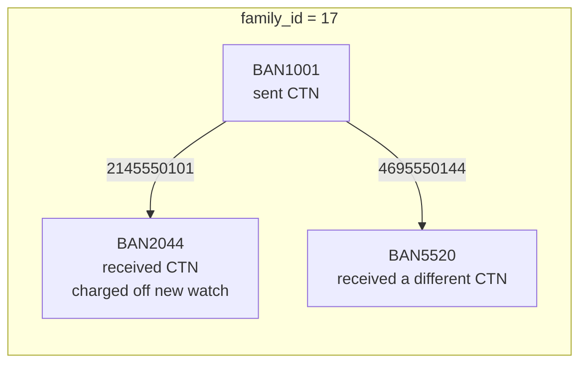
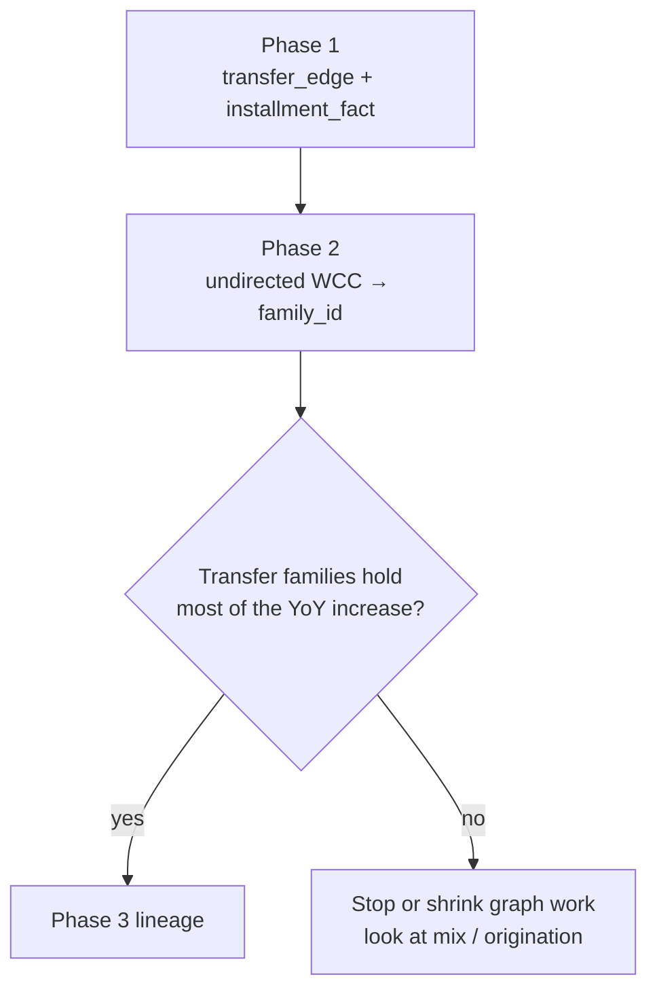
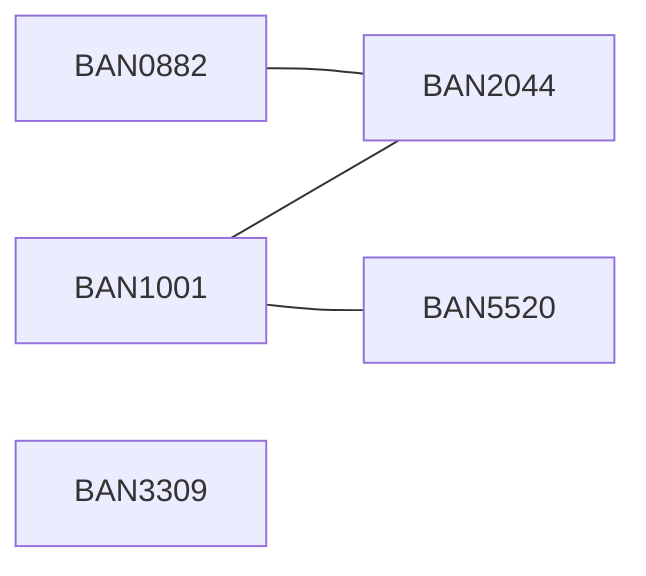

# Phase 2 Walkthrough

## Weakly connected components and the transfer-family measurement

**Goal.** Assign every BAN a `family_id` from the undirected transfer graph, join that family to equipment write-offs, and decide whether transfer-linked *account families* explain the year-over-year increase.

**Runtime.** DuckDB for joins and dollars. rustworkx for WCC. No Leiden, PageRank, or betweenness in this phase.

**Depends on Phase 1.** `transfer_edge`, `installment_fact`, `ban_map`, `src_account`.

**Exit criteria.**

- `ban_family` exists: one row per BAN, with `family_id` and `family_size`
- Equipment write-off dollars are split singleton vs transfer-family, prior 12 months vs current 12 months
- You have a written stop-go decision

---

## 1. Why Phase 2 exists

Phase 1 tagged installments with `ever_transferred_ctn`: the **line** moved at least once. That is necessary and not sufficient.

WCC answers a different question: does the **account that took the loss** sit in a connected cluster of BANs that exchanged lines, even if *this* installment’s CTN never moved?



The watch installment originated on BAN2044 after the inbound transfer. Phase 1 `ever_transferred_ctn` is true only because that CTN also moved. If BAN2044 later adds a brand-new CTN and writes off that device, Phase 1 would call the new CTN a singleton line. Phase 2 still places BAN2044 inside family 17.

That is the measurement you need before building lineage.



---

## 2. Graph used in this phase

**Projection P1 from the project model.**

| Item | Rule |
|---|---|
| Nodes | BANs in `ban_map` |
| Edges | `transfer_edge` treated as **undirected** |
| Multiplicity | Many CTNs can move A→B; WCC only needs “an edge exists” |
| Isolates | BANs with no transfer remain families of size 1 |

Direction does not matter for connectivity. A→B and B→A join the same family. Keep the directed table for Phase 4; collapse it here.

Do not add `SAME_ADDRESS` edges in Phase 2. Address linkage is a Phase 5 community input. Adding it now would mix household proximity into the TBR measurement.

---

## 3. Inputs from Phase 1

### 3.1 `transfer_edge` (required)

| ctn | from_ban | to_ban | transfer_dt | from_tenure_days | gap_days | line_type |
|---|---|---|---|---|---|---|
| 2145550101 | BAN1001 | BAN2044 | 2025-03-09 | 1149 | 0 | PHONE |
| 4695550144 | BAN1001 | BAN5520 | 2025-01-12 | 410 | 0 | PHONE |
| 2145550188 | BAN0882 | BAN2044 | 2025-06-20 | 95 | 1 | TABLET |

### 3.2 `ban_map` (required)

| ban | ban_idx |
|---|---|
| BAN0882 | 0 |
| BAN1001 | 1 |
| BAN2044 | 2 |
| BAN3309 | 3 |
| BAN5520 | 4 |

`ban_idx` must be a dense `0 .. N-1` integer. rustworkx node indices are integers. If Phase 1 maps are missing BANs that only appear on write-offs, rebuild the union before WCC.

### 3.3 `installment_fact` (required)

| installment_id | ctn | originated_ban | chargeoff_ban | eq_type | wo_dt | wo_amt | ever_transferred_ctn |
|---|---|---|---|---|---|---|---|
| EIP88101 | 2145550101 | BAN1001 | BAN2044 | PHONE | 2025-11-02 | 870.14 | TRUE |
| EIP88102 | 2145550101 | BAN2044 | BAN2044 | WATCH | 2025-11-02 | 398.00 | TRUE |
| EIP77011 | 5125550199 | BAN3309 | NULL | PHONE | NULL | 0.00 | FALSE |

### 3.4 `src_account` (recommended)

Used to attach isolates (BANs with no transfer) so every account gets a family, including size-1 singletons.

---

## 4. Target tables

### 4.1 `ban_family`

Grain: one row per BAN.

| Column | Type | Rule |
|---|---|---|
| `ban` | VARCHAR | Account key |
| `ban_idx` | INTEGER | rustworkx index |
| `family_id` | INTEGER | Component label; stable after sort |
| `family_size` | INTEGER | Count of BANs in the component |
| `is_transfer_family` | BOOLEAN | `family_size >= 2` |

**Sample.**

| ban | ban_idx | family_id | family_size | is_transfer_family |
|---|---|---|---|---|
| BAN0882 | 0 | 0 | 4 | TRUE |
| BAN1001 | 1 | 0 | 4 | TRUE |
| BAN2044 | 2 | 0 | 4 | TRUE |
| BAN3309 | 3 | 1 | 1 | FALSE |
| BAN5520 | 4 | 0 | 4 | TRUE |

BAN0882, BAN1001, BAN2044, and BAN5520 form one component because BAN1001 links to both BAN2044 and BAN5520, and BAN0882 also links to BAN2044.

### 4.2 `family_summary`

Grain: one row per family. Review object, not a graph input.

| family_id | family_size | n_transfers | n_ctns_moved | eq_wo_amt_current | eq_wo_amt_prior |
|---|---|---|---|---|---|
| 0 | 4 | 3 | 3 | 1268.14 | 0.00 |
| 1 | 1 | 0 | 0 | 0.00 | 0.00 |
| 2 | 2 | 1 | 1 | 0.00 | 410.00 |

### 4.3 `wo_family_split`

Grain: year window × transfer-family flag. This is the Phase 2 decision table.

| window | is_transfer_family | n_wo_installments | wo_amt |
|---|---|---|---|
| prior_12m | FALSE | 18440 | 18200000.00 |
| prior_12m | TRUE | 6120 | 9100000.00 |
| current_12m | FALSE | 17910 | 17900000.00 |
| current_12m | TRUE | 9805 | 16800000.00 |

The numbers above are illustrative. Replace them with your query output. The pattern shown — singleton flat, transfer-family up — is what would justify Phase 3.

---

## 5. Build sequence

Use a writable DuckDB session against the same file that holds Phase 1 tables, or read Phase 1 Parquet sidecars.

```python
import duckdb
from pathlib import Path

DB = Path("your_extract.duckdb")
con = duckdb.connect(str(DB))
con.execute("CREATE SCHEMA IF NOT EXISTS g;")
```

If Phase 1 objects live at the root (no `g.` schema), drop the prefix in the SQL below.

### 5.1 Export a thin undirected edge list

WCC does not need CTN, dates, or weights. Deduplicate BAN pairs.

```sql
CREATE OR REPLACE TABLE g.wcc_edges AS
SELECT DISTINCT
  least(f.ban_idx, t.ban_idx)  AS src,
  greatest(f.ban_idx, t.ban_idx) AS dst
FROM transfer_edge e
JOIN ban_map f ON f.ban = e.from_ban
JOIN ban_map t ON t.ban = e.to_ban
WHERE e.from_ban <> e.to_ban;

COPY g.wcc_edges TO 'wcc_edges.parquet' (FORMAT PARQUET);
```

Sanity:

```sql
SELECT
  count(*) AS undirected_pairs,
  (SELECT count(*) FROM transfer_edge) AS directed_or_multi_ctn_rows
FROM g.wcc_edges;
```

`undirected_pairs` should be less than or equal to `transfer_edge` row count.

### 5.2 Ensure every BAN is in the map

```sql
CREATE OR REPLACE TABLE ban_map AS
SELECT ban, row_number() OVER (ORDER BY ban) - 1 AS ban_idx
FROM (
  SELECT ban FROM src_account
  UNION
  SELECT from_ban FROM transfer_edge
  UNION
  SELECT to_ban FROM transfer_edge
  UNION
  SELECT chargeoff_ban FROM installment_fact WHERE chargeoff_ban IS NOT NULL
  UNION
  SELECT originated_ban FROM installment_fact WHERE originated_ban IS NOT NULL
);
```

Rebuild `g.wcc_edges` after this if `ban_idx` values changed.

### 5.3 Run WCC in rustworkx

```python
import duckdb
import rustworkx as rx
import pandas as pd

con = duckdb.connect("your_extract.duckdb")

ban_map = con.sql("SELECT ban, ban_idx FROM ban_map ORDER BY ban_idx").df()
edges = con.sql("SELECT src, dst FROM g.wcc_edges").df()

n = int(ban_map["ban_idx"].max()) + 1
graph = rx.PyGraph()
graph.add_nodes_from(range(n))

# rustworkx ignores unknown indices; fail loud instead
if len(edges):
    bad = edges[(edges["src"] < 0) | (edges["dst"] < 0) | (edges["src"] >= n) | (edges["dst"] >= n)]
    if len(bad):
        raise ValueError(f"Edge endpoints outside 0..{n-1}: {len(bad)} rows")
    graph.extend_from_edge_list(list(map(tuple, edges[["src", "dst"]].to_numpy())))

components = rx.connected_components(graph)
# components: list[set[int]] — one set of ban_idx per family
```

`connected_components` on `PyGraph` is the undirected WCC. Do not use `strongly_connected_components`; that is a directed concept and would split A→B from an absent B→A.

### 5.4 Relabel families so IDs are stable and size-aware

rustworkx does not promise component order. Sort by minimum `ban_idx` so reruns are deterministic.

```python
rows = []
for sets in components:
    members = sorted(sets)
    if not members:
        continue
    family_id = members[0]  # placeholder; replace after sort
    rows.append(members)

rows.sort(key=lambda m: (len(m) == 1, m[0]))  # optional: multi-BAN families first
records = []
for family_id, members in enumerate(rows):
    size = len(members)
    for ban_idx in members:
        records.append(
            {
                "ban_idx": int(ban_idx),
                "family_id": int(family_id),
                "family_size": int(size),
                "is_transfer_family": size >= 2,
            }
        )

family_idx = pd.DataFrame.from_records(records)
ban_family = ban_map.merge(family_idx, on="ban_idx", how="left")

missing = ban_family["family_id"].isna().sum()
if missing:
    raise ValueError(f"{missing} BANs did not receive a component; graph node count != ban_map")

con.register("ban_family_df", ban_family)
con.execute("CREATE OR REPLACE TABLE ban_family AS SELECT * FROM ban_family_df")
```

Isolates: rustworkx still returns a one-node component for every node you added. If you built the graph with `add_nodes_from(range(n))`, size-1 families appear automatically. If you only added endpoints of edges, isolates would be missing — that is why the graph is created from the full `ban_map`.

### 5.5 Family summary and write-off split

Adjust the two window dates to the same convention used in Phase 1.

```sql
CREATE OR REPLACE TABLE family_summary AS
WITH xfer AS (
  SELECT
    b.family_id,
    count(*) AS n_transfers,
    count(DISTINCT e.ctn) AS n_ctns_moved
  FROM transfer_edge e
  JOIN ban_family b ON b.ban = e.from_ban
  GROUP BY 1
),
wo AS (
  SELECT
    f.family_id,
    sum(CASE
          WHEN i.wo_dt >= DATE '2024-10-01' AND i.wo_dt < DATE '2025-10-01'
          THEN i.wo_amt ELSE 0 END) AS eq_wo_amt_prior,
    sum(CASE
          WHEN i.wo_dt >= DATE '2025-10-01' AND i.wo_dt < DATE '2026-10-01'
          THEN i.wo_amt ELSE 0 END) AS eq_wo_amt_current
  FROM installment_fact i
  JOIN ban_family f ON f.ban = i.chargeoff_ban
  WHERE i.wo_amt > 0
  GROUP BY 1
)
SELECT
  f.family_id,
  any_value(f.family_size) AS family_size,
  coalesce(x.n_transfers, 0) AS n_transfers,
  coalesce(x.n_ctns_moved, 0) AS n_ctns_moved,
  coalesce(w.eq_wo_amt_prior, 0) AS eq_wo_amt_prior,
  coalesce(w.eq_wo_amt_current, 0) AS eq_wo_amt_current
FROM (SELECT DISTINCT family_id, family_size FROM ban_family) f
LEFT JOIN xfer x USING (family_id)
LEFT JOIN wo w USING (family_id);

CREATE OR REPLACE TABLE wo_family_split AS
SELECT
  CASE
    WHEN i.wo_dt >= DATE '2025-10-01' AND i.wo_dt < DATE '2026-10-01' THEN 'current_12m'
    WHEN i.wo_dt >= DATE '2024-10-01' AND i.wo_dt < DATE '2025-10-01' THEN 'prior_12m'
    ELSE 'out_of_window'
  END AS window,
  f.is_transfer_family,
  count(*) AS n_wo_installments,
  sum(i.wo_amt) AS wo_amt
FROM installment_fact i
JOIN ban_family f ON f.ban = i.chargeoff_ban
WHERE i.wo_amt > 0
GROUP BY 1, 2
ORDER BY 1, 2;
```

Join write-offs on **`chargeoff_ban`**, not `originated_ban`. The question is which family absorbed the loss.

### 5.6 Optional: compare Phase 1 CTN flag to Phase 2 family flag

```sql
SELECT
  i.ever_transferred_ctn,
  f.is_transfer_family,
  count(*) AS n_wo,
  sum(i.wo_amt) AS wo_amt
FROM installment_fact i
JOIN ban_family f ON f.ban = i.chargeoff_ban
WHERE i.wo_amt > 0
  AND i.wo_dt >= DATE '2025-10-01'
  AND i.wo_dt <  DATE '2026-10-01'
GROUP BY 1, 2
ORDER BY 1, 2;
```

| ever_transferred_ctn | is_transfer_family | Meaning |
|---|---|---|
| TRUE | TRUE | Line moved; loss sits in a transfer family (expected) |
| FALSE | TRUE | Line never moved; destination BAN still sits in a transfer cluster (Phase 2 value) |
| TRUE | FALSE | Should be rare; investigate occupancy vs charge-off BAN |
| FALSE | FALSE | Singleton origination loss |

The second row is why WCC is not a duplicate of Phase 1.

---

## 6. Optional DuckDB check on the same edges

Use this only as a cross-check on a sample or a modest edge list. It is not the primary engine.

```sql
-- Recursive union-find style component expansion on integer ids
CREATE OR REPLACE TABLE g.wcc_check AS
WITH RECURSIVE seed AS (
  SELECT src AS node, src AS root FROM g.wcc_edges
  UNION
  SELECT dst, dst FROM g.wcc_edges
),
walk AS (
  SELECT node, root FROM seed
  UNION
  SELECT
    CASE WHEN e.src = w.node THEN e.dst ELSE e.src END AS node,
    least(w.root, e.src, e.dst) AS root
  FROM walk w
  JOIN g.wcc_edges e
    ON e.src = w.node OR e.dst = w.node
)
SELECT node AS ban_idx, min(root) AS family_root
FROM walk
GROUP BY 1;
```

Recursive CTEs can be slow or memory-heavy on large edge lists. rustworkx is the system of record for `family_id`. If you run this check, compare component counts, not raw IDs.

```sql
SELECT
  (SELECT count(DISTINCT family_id) FROM ban_family WHERE family_size >= 2) AS rx_multi,
  (SELECT count(DISTINCT family_root) FROM g.wcc_check) AS sql_components_incl_isolates_incomplete;
```

The SQL walk above only sees nodes that appear in `g.wcc_edges`, so isolate counts will not match `ban_family`. Compare only nodes that appear in both.

---

## 7. Validation

```sql
-- 1. Every BAN has exactly one family
SELECT
  count(*) AS bans,
  count(DISTINCT ban) AS distinct_bans,
  count(*) FILTER (WHERE family_id IS NULL) AS missing_family
FROM ban_family;

-- 2. family_size is internally consistent
SELECT count(*)
FROM ban_family
GROUP BY family_id, family_size
HAVING count(*) <> family_size;

-- 3. Every transfer endpoint is in a family of size >= 2
SELECT count(*)
FROM transfer_edge e
JOIN ban_family f ON f.ban = e.from_ban
WHERE f.family_size < 2;

-- 4. Concentration: share of current-year WO in the largest families
SELECT
  family_id,
  family_size,
  eq_wo_amt_current,
  eq_wo_amt_current / nullif(sum(eq_wo_amt_current) OVER (), 0) AS share
FROM family_summary
ORDER BY eq_wo_amt_current DESC
LIMIT 20;
```

Pass rules:

- `missing_family = 0`
- query 2 returns no rows
- query 3 returns 0
- self-loops were already removed in Phase 1

---

## 8. How to read the stop-go table

Compute the increase inside each cell:

```sql
SELECT
  is_transfer_family,
  sum(wo_amt) FILTER (WHERE window = 'current_12m') AS current_amt,
  sum(wo_amt) FILTER (WHERE window = 'prior_12m')   AS prior_amt,
  sum(wo_amt) FILTER (WHERE window = 'current_12m')
    - sum(wo_amt) FILTER (WHERE window = 'prior_12m') AS delta_amt
FROM wo_family_split
WHERE window IN ('current_12m', 'prior_12m')
GROUP BY 1;
```

| Result | Decision |
|---|---|
| Most of `delta_amt` is in `is_transfer_family = TRUE` | Proceed to Phase 3 lineage. The TBR thesis is still live. |
| `delta_amt` is almost entirely in singletons | Stop treating transfers as the main driver. Check origination mix, device price, channel, and collections on non-moving accounts. |
| Both cells rise | Continue Phase 3, but expect a mixed story. Do not attribute the entire increase to TBR. |
| Transfer-family dollars are large but `delta_amt` is not | Transfers are common in the stock of write-offs, not in the increase. Do not confuse level with change. |

Also inspect concentration. If five families contain most of the transfer-family increase, Phase 3 and Phase 5 should start there rather than on the full graph.

---

## 9. Worked sample

Using the three Phase 1 edges:



WCC output:

- Component `{BAN0882, BAN1001, BAN2044, BAN5520}` → `family_id = 0`, size 4  
- Component `{BAN3309}` → `family_id = 1`, size 1  

Write-offs EIP88101 and EIP88102 both charge off on BAN2044, therefore both dollars sit in family 0, including the watch originated after the transfer.

That is the Phase 2 claim: **the destination account’s loss is transfer-family loss**, whether or not every installment itself moved.

---

## 10. Performance notes

WCC is \(O(n + m)\) on the undirected pair list, not on the full subscriber population.

| Transfer-graph size | Expected WCC time on a workstation |
|---|---|
| Tens of thousands of BANs | Sub-second to a few seconds |
| Low millions of undirected pairs | Seconds to low tens of seconds |

The expensive step is usually the DuckDB join of write-offs to `ban_family`, not rustworkx. Keep `ban_family` thin. Do not attach address text or credit columns before WCC.

If `ban_map` has tens of millions of isolates, creating `PyGraph` with that many nodes still works but wastes memory. A practical filter: run WCC on BANs that appear in `transfer_edge` **plus** BANs that have an equipment write-off in the two windows, then left-join isolates as `family_size = 1` in SQL.

```sql
-- optional slimmer node set for rustworkx
CREATE OR REPLACE TABLE g.wcc_nodes AS
SELECT DISTINCT ban FROM (
  SELECT from_ban AS ban FROM transfer_edge
  UNION
  SELECT to_ban FROM transfer_edge
  UNION
  SELECT chargeoff_ban FROM installment_fact
   WHERE wo_amt > 0
     AND wo_dt >= DATE '2024-10-01'
     AND wo_dt <  DATE '2026-10-01'
);
```

Rebuild a local `ban_idx` on that subset only. Map scores back to the full `ban_map` with a left join; unmatched BANs are singleton families.

---

## 11. What Phase 2 does not build

- Installment hop lineage (`wo_lineage`) — Phase 3  
- In-degree, PageRank, betweenness — Phase 4  
- Leiden / address communities — Phase 5  
- Similarity watchlists  

Do not weight WCC by write-off dollars. Connectivity is unweighted. Dollars are attached after the component is labeled.

---

## 12. Deliverables

1. `ban_family`  
2. `family_summary`  
3. `wo_family_split`  
4. The four-cell comparison of Phase 1 `ever_transferred_ctn` vs Phase 2 `is_transfer_family`  
5. A one-paragraph stop-go note: proceed, stop, or mixed  

Phase 2 is complete when that paragraph is written from the dollar table, not from a picture of the graph.
