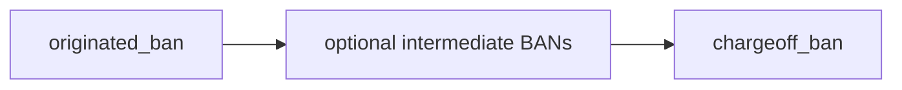
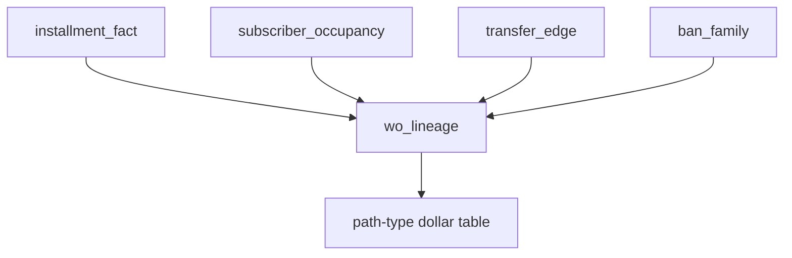
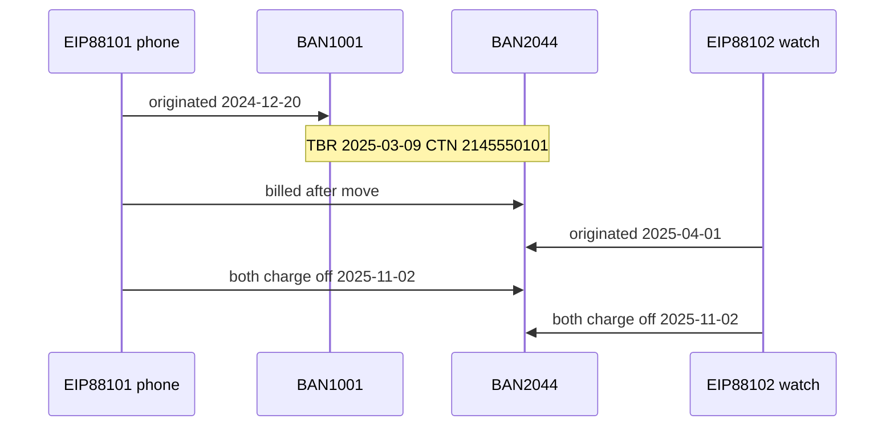

# Phase 3 Walkthrough

## Installment lineage and path-type attribution

**Goal.** For every equipment write-off in the two year-over-year windows, reconstruct the path from origin BAN to charge-off BAN and classify the loss as **moved EIP** or **new EIP after transfer**.

**Runtime.** DuckDB is the system of record. rustworkx BFS is optional and used only for BAN–BAN hop distance on the transfer graph.

**Depends on.** `subscriber_occupancy`, `transfer_edge`, `installment_fact`, `ban_family` (Phase 2).

**Do this phase only if** Phase 2 showed that transfer families hold a material share of the *increase*. If the increase is in singleton families, skip to a mix / origination review instead.

**Exit criteria.**

- `wo_lineage` exists at installment grain  
- Dollars can be split: moved EIP vs new EIP after transfer, by window, equipment type, and hop count  
- Household-like single-hop moves are separable from multi-hop or post-transfer stacking  

---

## 1. What lineage means

An equipment write-off has a device agreement, a CTN, and a BAN that took the loss. Lineage asks four factual questions:

1. On which BAN was the installment originated?  
2. On which BAN did it charge off?  
3. Did that CTN move between those dates, and how many times?  
4. Was the installment opened before the last inbound transfer to the charge-off BAN, or after it?



SQL on occupancy and transfers answers 1–4 for almost every row. Graph search is not required to classify path type.



---

## 2. Path types to assign

Assign exactly one `path_type` per written-off installment.

| path_type | Rule |
|---|---|
| `moved_eip` | Agreement originated on BAN A, charged off on BAN B ≠ A, and the CTN has a transfer A…→…B (or A→B directly) after `orig_dt` |
| `new_eip_after_transfer` | Agreement originated on the charge-off BAN, and that CTN or that BAN had an inbound transfer before `orig_dt` |
| `new_eip_on_transfer_family` | Agreement never moved; CTN never moved; charge-off BAN still sits in a Phase 2 transfer family (other lines moved) |
| `singleton` | Charge-off BAN is a size-1 family and the CTN never transferred |
| `ambiguous` | Overlapping occupancy, missing dates, or origin BAN unknown |

`new_eip_after_transfer` is the credit-seasoning / stacking bucket.  
`moved_eip` is the liability-handoff bucket.  
`new_eip_on_transfer_family` is the Phase 2-only residual.

---

## 3. Target table: `wo_lineage`

Grain: one written-off installment in the two windows.

| Column | Type | Source |
|---|---|---|
| `installment_id` | VARCHAR | installment_fact |
| `ctn` | VARCHAR | |
| `eq_type` | VARCHAR | |
| `orig_amt` | DOUBLE | |
| `orig_dt` | DATE | |
| `wo_dt` | DATE | |
| `wo_amt` | DOUBLE | |
| `originated_ban` | VARCHAR | |
| `chargeoff_ban` | VARCHAR | |
| `channel` | VARCHAR | |
| `agent_id` | VARCHAR | |
| `family_id` | INTEGER | ban_family on chargeoff_ban |
| `family_size` | INTEGER | |
| `hop_count` | INTEGER | transfers of this CTN between orig_dt and wo_dt |
| `first_transfer_dt` | DATE | this CTN |
| `last_inbound_dt_to_chargeoff` | DATE | last transfer onto chargeoff_ban for this CTN before wo_dt |
| `days_orig_to_wo` | INTEGER | |
| `days_last_xfer_to_orig` | INTEGER | null if orig precedes last inbound |
| `days_last_xfer_to_wo` | INTEGER | |
| `receiving_ban_age_at_inbound` | INTEGER | chargeoff BAN age at last inbound |
| `path_type` | VARCHAR | see §2 |
| `window` | VARCHAR | prior_12m / current_12m |

### Sample

| installment_id | ctn | originated_ban | chargeoff_ban | orig_dt | wo_dt | wo_amt | hop_count | path_type |
|---|---|---|---|---|---|---|---|---|
| EIP88101 | 2145550101 | BAN1001 | BAN2044 | 2024-12-20 | 2025-11-02 | 870.14 | 1 | moved_eip |
| EIP88102 | 2145550101 | BAN2044 | BAN2044 | 2025-04-01 | 2025-11-02 | 398.00 | 1 | new_eip_after_transfer |
| EIP77011 | 5125550199 | BAN3309 | BAN3309 | 2023-06-01 | 2025-08-14 | 210.00 | 0 | singleton |

EIP88102 originated 23 days after the 2025-03-09 inbound transfer. That timing is the stacking signal.

---

## 4. Build in DuckDB

Restrict to equipment write-offs in the analysis windows first.

```sql
CREATE OR REPLACE TABLE g.wo_base AS
SELECT
  i.*,
  CASE
    WHEN i.wo_dt >= DATE '2025-10-01' AND i.wo_dt < DATE '2026-10-01' THEN 'current_12m'
    WHEN i.wo_dt >= DATE '2024-10-01' AND i.wo_dt < DATE '2025-10-01' THEN 'prior_12m'
    ELSE 'out_of_window'
  END AS window
FROM installment_fact i
WHERE i.wo_amt > 0
  AND i.wo_dt >= DATE '2024-10-01'
  AND i.wo_dt <  DATE '2026-10-01';
```

### 4.1 Transfers on the same CTN inside the installment life

```sql
CREATE OR REPLACE TABLE g.ctn_hops AS
SELECT
  w.installment_id,
  count(*) AS hop_count,
  min(e.transfer_dt) AS first_transfer_dt,
  max(e.transfer_dt) AS last_transfer_dt
FROM g.wo_base w
JOIN transfer_edge e
  ON e.ctn = w.ctn
 AND e.transfer_dt >= w.orig_dt
 AND e.transfer_dt <= w.wo_dt
GROUP BY 1;
```

### 4.2 Last inbound transfer onto the charge-off BAN for that CTN

```sql
CREATE OR REPLACE TABLE g.last_inbound AS
SELECT
  w.installment_id,
  max(e.transfer_dt) AS last_inbound_dt_to_chargeoff,
  arg_max(e.from_ban, e.transfer_dt) AS last_from_ban
FROM g.wo_base w
JOIN transfer_edge e
  ON e.ctn = w.ctn
 AND e.to_ban = w.chargeoff_ban
 AND e.transfer_dt <= w.wo_dt
GROUP BY 1;
```

`arg_max` is available in current DuckDB. If your client lacks it, use a quality row_number filter.

```sql
CREATE OR REPLACE TABLE g.last_inbound AS
SELECT installment_id, transfer_dt AS last_inbound_dt_to_chargeoff, from_ban AS last_from_ban
FROM (
  SELECT
    w.installment_id,
    e.transfer_dt,
    e.from_ban,
    row_number() OVER (PARTITION BY w.installment_id ORDER BY e.transfer_dt DESC) AS rn
  FROM g.wo_base w
  JOIN transfer_edge e
    ON e.ctn = w.ctn
   AND e.to_ban = w.chargeoff_ban
   AND e.transfer_dt <= w.wo_dt
)
WHERE rn = 1;
```

### 4.3 Receiving BAN age at inbound

```sql
CREATE OR REPLACE TABLE g.ban_age AS
SELECT
  w.installment_id,
  date_diff('day', a.account_open_dt, i.last_inbound_dt_to_chargeoff) AS receiving_ban_age_at_inbound
FROM g.wo_base w
JOIN g.last_inbound i USING (installment_id)
JOIN src_account a ON a.ban = w.chargeoff_ban;
```

### 4.4 Assemble and classify

```sql
CREATE OR REPLACE TABLE wo_lineage AS
SELECT
  w.*,
  f.family_id,
  f.family_size,
  f.is_transfer_family,
  coalesce(h.hop_count, 0) AS hop_count,
  h.first_transfer_dt,
  i.last_inbound_dt_to_chargeoff,
  date_diff('day', w.orig_dt, w.wo_dt) AS days_orig_to_wo,
  CASE
    WHEN i.last_inbound_dt_to_chargeoff IS NOT NULL
     AND w.orig_dt >= i.last_inbound_dt_to_chargeoff
    THEN date_diff('day', i.last_inbound_dt_to_chargeoff, w.orig_dt)
  END AS days_last_xfer_to_orig,
  CASE
    WHEN i.last_inbound_dt_to_chargeoff IS NOT NULL
    THEN date_diff('day', i.last_inbound_dt_to_chargeoff, w.wo_dt)
  END AS days_last_xfer_to_wo,
  b.receiving_ban_age_at_inbound,
  CASE
    WHEN w.originated_ban IS NULL OR w.chargeoff_ban IS NULL OR w.orig_dt IS NULL
      THEN 'ambiguous'
    WHEN w.originated_ban <> w.chargeoff_ban
     AND i.last_inbound_dt_to_chargeoff IS NOT NULL
     AND w.orig_dt < i.last_inbound_dt_to_chargeoff
      THEN 'moved_eip'
    WHEN w.originated_ban <> w.chargeoff_ban
     AND coalesce(h.hop_count, 0) >= 1
      THEN 'moved_eip'
    WHEN w.originated_ban = w.chargeoff_ban
     AND i.last_inbound_dt_to_chargeoff IS NOT NULL
     AND w.orig_dt >= i.last_inbound_dt_to_chargeoff
      THEN 'new_eip_after_transfer'
    WHEN f.is_transfer_family
     AND coalesce(h.hop_count, 0) = 0
      THEN 'new_eip_on_transfer_family'
    WHEN NOT f.is_transfer_family
     AND coalesce(h.hop_count, 0) = 0
      THEN 'singleton'
    ELSE 'ambiguous'
  END AS path_type
FROM g.wo_base w
LEFT JOIN ban_family f ON f.ban = w.chargeoff_ban
LEFT JOIN g.ctn_hops h USING (installment_id)
LEFT JOIN g.last_inbound i USING (installment_id)
LEFT JOIN g.ban_age b USING (installment_id);
```

Classification order matters. Check `moved_eip` before family residuals so a true handoff is not labeled as “family only.”

---

## 5. Optional BAN–BAN hop distance in rustworkx

Use this when you need shortest-path hops on the *account* graph rather than CTN transfer count. A CTN that moved A→B→C has hop_count 2. Shortest-path distance between A and C on the undirected family graph may be 1 if another CTN already linked A–C.

```python
import duckdb
import rustworkx as rx

con = duckdb.connect("your_extract.duckdb")
edges = con.sql("""
  SELECT DISTINCT f.ban_idx AS src, t.ban_idx AS dst
  FROM transfer_edge e
  JOIN ban_map f ON f.ban = e.from_ban
  JOIN ban_map t ON t.ban = e.to_ban
""").df()

g = rx.PyGraph()
n = int(con.sql("SELECT max(ban_idx)+1 FROM ban_map").fetchone()[0])
g.add_nodes_from(range(n))
g.extend_from_edge_list(list(map(tuple, edges[["src", "dst"]].to_numpy())))

# Example: distance from originated_ban to chargeoff_ban for moved EIP rows
pairs = con.sql("""
  SELECT installment_id, o.ban_idx AS src, c.ban_idx AS dst
  FROM wo_lineage w
  JOIN ban_map o ON o.ban = w.originated_ban
  JOIN ban_map c ON c.ban = w.chargeoff_ban
  WHERE w.path_type = 'moved_eip'
""").df()

def dist(src, dst):
    if src == dst:
        return 0
    pred = rx.dijkstra_shortest_paths(g, src, target=dst)
    if dst not in pred:
        return None
    return max(len(pred[dst]) - 1, 0)

pairs["ban_graph_hops"] = [dist(int(s), int(d)) for s, d in zip(pairs["src"], pairs["dst"])]
```

Store `ban_graph_hops` only as a helper. **CTN hop_count remains the primary hop measure** because liability follows the line, not the shortest account path.

---

## 6. Attribution queries

```sql
-- Core path-type split
SELECT window, path_type, count(*) AS n, sum(wo_amt) AS wo_amt
FROM wo_lineage
GROUP BY 1, 2
ORDER BY 1, 2;

-- Stacking speed
SELECT
  window,
  CASE
    WHEN days_last_xfer_to_orig < 30 THEN '0_29'
    WHEN days_last_xfer_to_orig < 90 THEN '30_89'
    WHEN days_last_xfer_to_orig IS NOT NULL THEN '90_plus'
    ELSE 'n_a'
  END AS orig_lag,
  sum(wo_amt) AS wo_amt
FROM wo_lineage
WHERE path_type = 'new_eip_after_transfer'
GROUP BY 1, 2
ORDER BY 1, 2;

-- Equipment mix inside transfer paths
SELECT window, path_type, eq_type, sum(wo_amt) AS wo_amt
FROM wo_lineage
GROUP BY 1, 2, 3
ORDER BY 1, 2, 3;

-- Channel / agent concentration on stacking
SELECT window, channel, agent_id, count(*) AS n, sum(wo_amt) AS wo_amt
FROM wo_lineage
WHERE path_type = 'new_eip_after_transfer'
GROUP BY 1, 2, 3
ORDER BY 5 DESC
LIMIT 50;
```

Year-over-year change by path type:

```sql
SELECT
  path_type,
  sum(wo_amt) FILTER (WHERE window = 'current_12m') AS current_amt,
  sum(wo_amt) FILTER (WHERE window = 'prior_12m')   AS prior_amt,
  sum(wo_amt) FILTER (WHERE window = 'current_12m')
    - sum(wo_amt) FILTER (WHERE window = 'prior_12m') AS delta_amt
FROM wo_lineage
GROUP BY 1
ORDER BY delta_amt DESC;
```

---

## 7. Control flags (do not treat as fraud)

```sql
ALTER TABLE wo_lineage ADD COLUMN IF NOT EXISTS household_like BOOLEAN;

UPDATE wo_lineage w
SET household_like =
  path_type IN ('moved_eip', 'new_eip_after_transfer')
  AND hop_count <= 1
  AND coalesce(days_last_xfer_to_orig, 9999) > 90
  AND eq_type = 'PHONE'
  AND family_size <= 3;
```

Tighten this later with `SAME_ADDRESS` in Phase 5. In Phase 3, long lag + single hop + small family is only a **soft** household control.

---

## 8. Validation

```sql
-- Every in-window equipment WO has a lineage row
SELECT
  (SELECT count(*) FROM g.wo_base) AS wo_base,
  (SELECT count(*) FROM wo_lineage) AS lineage;

-- Ambiguous share should be small
SELECT path_type, count(*), sum(wo_amt)
FROM wo_lineage
GROUP BY 1;

-- moved_eip must change BAN
SELECT count(*)
FROM wo_lineage
WHERE path_type = 'moved_eip'
  AND originated_ban = chargeoff_ban;

-- new_eip_after_transfer must have an inbound date
SELECT count(*)
FROM wo_lineage
WHERE path_type = 'new_eip_after_transfer'
  AND last_inbound_dt_to_chargeoff IS NULL;
```

Pass rules: row counts match; the two contradiction queries return 0; `ambiguous` is a residual, not a dominant bucket.

---

## 9. Worked path picture



Same CTN, two path types, one family. Phase 6 will add these two dollars into different increase cells.

---

## 10. What Phase 3 does not build

- Hub scores  
- Communities  
- A fraud label  

`path_type` is an attribution code. Operations review happens in Phase 6.

---

## 11. Deliverables

1. `wo_lineage`  
2. Path-type dollar table for both windows  
3. Stacking-lag and equipment-type cuts  
4. Short note: which path_type holds the increase  

Phase 4 starts only after that note exists.
