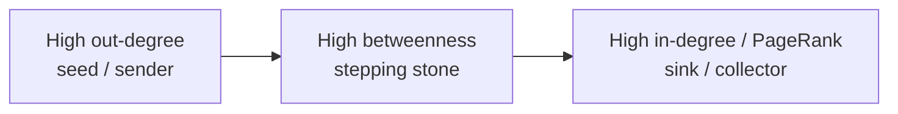
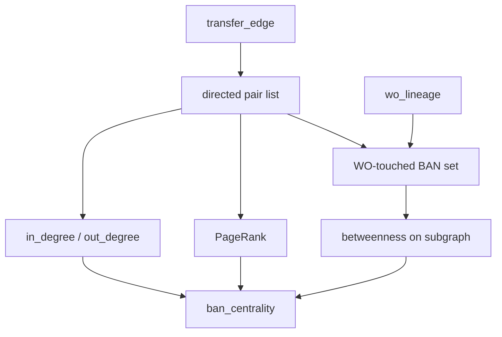

# Phase 4 Walkthrough

## Directed transfer hubs: degree, PageRank, and restricted betweenness

**Goal.** Rank BANs (and then agents) by how they concentrate transfer flow that later becomes equipment write-off, without treating every high-degree family account as a bad actor.

**Depends on.** `transfer_edge`, `ban_map`, `ban_family`, `wo_lineage`.

**Do this phase only if** Phase 2–3 showed transfer families and transfer path types hold the increase.

**Exit criteria.**

- `ban_centrality` populated  
- In-degree, out-degree, and PageRank joined to current-window equipment WO  
- Betweenness computed only on the write-off-touched subgraph  
- Top hubs reviewed against path_type mix, not scores alone  

---

## 1. Why centrality is a second-wave tool

WCC says two BANs are in the same family. Lineage says how an installment died. Centrality says which accounts in that family **collect, shed, or sit between** those movements.



Use directed edges. A family add that only receives lines is not the same object as an account that sends lines before its own stress.

Do not run exact Brandes on the full BAN map.

---

## 2. Graph used in this phase

| Projection | Edges | Algorithm |
|---|---|---|
| Directed multi-collapsed | one edge A→B if any CTN moved A→B | in/out degree, PageRank |
| Same, weighted | weight = CTN count, or count of CTNs with later equipment WO | weighted PageRank |
| WO-touched subgraph | BANs in families that have current or prior equipment WO | betweenness only |



---

## 3. Target table: `ban_centrality`

Grain: one BAN.

| Column | Type |
|---|---|
| `ban` | VARCHAR |
| `ban_idx` | INTEGER |
| `family_id` | INTEGER |
| `family_size` | INTEGER |
| `in_degree` | INTEGER |
| `out_degree` | INTEGER |
| `in_ctn` | INTEGER |
| `out_ctn` | INTEGER |
| `pagerank` | DOUBLE |
| `pagerank_wo` | DOUBLE |
| `betweenness` | DOUBLE |
| `betweenness_scope` | VARCHAR |
| `eq_wo_amt_current` | DOUBLE |
| `eq_wo_amt_prior` | DOUBLE |

### Sample

| ban | in_degree | out_degree | pagerank | betweenness | eq_wo_amt_current |
|---|---|---|---|---|---|
| BAN2044 | 2 | 0 | 0.041 | 0.000 | 1268.14 |
| BAN1001 | 0 | 2 | 0.012 | 0.018 | 0.00 |
| BAN0882 | 0 | 1 | 0.009 | 0.000 | 0.00 |

BAN2044 is a sink. BAN1001 is a sender. Neither score is an accusation until path_type dollars are attached.

---

## 4. Build the directed pair list

```sql
CREATE OR REPLACE TABLE g.dir_pairs AS
SELECT
  e.from_ban,
  e.to_ban,
  f.ban_idx AS src,
  t.ban_idx AS dst,
  count(*) AS ctn_moves,
  count(*) FILTER (
    WHERE EXISTS (
      SELECT 1 FROM wo_lineage w
      WHERE w.ctn = e.ctn
        AND w.chargeoff_ban = e.to_ban
    )
  ) AS ctn_moves_then_wo
FROM transfer_edge e
JOIN ban_map f ON f.ban = e.from_ban
JOIN ban_map t ON t.ban = e.to_ban
WHERE e.from_ban <> e.to_ban
GROUP BY 1, 2, 3, 4;
```

---

## 5. Degree in SQL

Degree does not need rustworkx.

```sql
CREATE OR REPLACE TABLE g.ban_degree AS
SELECT
  ban_idx,
  ban,
  sum(in_degree) AS in_degree,
  sum(out_degree) AS out_degree,
  sum(in_ctn) AS in_ctn,
  sum(out_ctn) AS out_ctn
FROM (
  SELECT to_ban AS ban, dst AS ban_idx,
         count(*) AS in_degree, 0 AS out_degree,
         sum(ctn_moves) AS in_ctn, 0 AS out_ctn
  FROM g.dir_pairs
  GROUP BY 1, 2
  UNION ALL
  SELECT from_ban, src,
         0, count(*),
         0, sum(ctn_moves)
  FROM g.dir_pairs
  GROUP BY 1, 2
)
GROUP BY 1, 2;
```

---

## 6. PageRank in rustworkx

Use `PyDiGraph`. Unweighted first, then a WO-weighted variant.

```python
import duckdb
import rustworkx as rx
import pandas as pd

con = duckdb.connect("your_extract.duckdb")
n = int(con.sql("SELECT max(ban_idx)+1 FROM ban_map").fetchone()[0])
pairs = con.sql("SELECT src, dst, ctn_moves, ctn_moves_then_wo FROM g.dir_pairs").df()

g = rx.PyDiGraph()
g.add_nodes_from(range(n))
for r in pairs.itertuples(index=False):
    g.add_edge(int(r.src), int(r.dst), float(r.ctn_moves))

pr = rx.pagerank(g, weight_fn=lambda w: w)

g_wo = rx.PyDiGraph()
g_wo.add_nodes_from(range(n))
for r in pairs.itertuples(index=False):
    w = float(r.ctn_moves_then_wo) if r.ctn_moves_then_wo else 0.0
    if w > 0:
        g_wo.add_edge(int(r.src), int(r.dst), w)

# Isolated nodes are fine; skip pagerank on an empty WO graph
pr_wo = rx.pagerank(g_wo, weight_fn=lambda w: w) if g_wo.num_edges() else {}

pr_df = pd.DataFrame({
    "ban_idx": list(range(n)),
    "pagerank": [float(pr.get(i, 0.0)) for i in range(n)],
    "pagerank_wo": [float(pr_wo.get(i, 0.0)) for i in range(n)],
})
con.register("pr_df", pr_df)
con.execute("CREATE OR REPLACE TABLE g.ban_pagerank AS SELECT * FROM pr_df")
```

`pagerank_wo` ranks sinks on paths that later charged off. That is the score to sort review lists. Unweighted PageRank is the structural control.

---

## 7. Betweenness only on the WO-touched subgraph

Exact Brandes is \(O(nm)\). Restrict nodes to BANs that either (a) have equipment WO in the two windows or (b) sit in a Phase 2 family that has such WO **and** appear on at least one transfer.

```sql
CREATE OR REPLACE TABLE g.wo_touch_ban AS
SELECT DISTINCT ban
FROM (
  SELECT chargeoff_ban AS ban FROM wo_lineage
  UNION
  SELECT originated_ban FROM wo_lineage
  UNION
  SELECT e.from_ban
  FROM transfer_edge e
  JOIN ban_family f ON f.ban = e.from_ban
  WHERE f.family_id IN (SELECT DISTINCT family_id FROM wo_lineage)
  UNION
  SELECT e.to_ban
  FROM transfer_edge e
  JOIN ban_family f ON f.ban = e.to_ban
  WHERE f.family_id IN (SELECT DISTINCT family_id FROM wo_lineage)
);

CREATE OR REPLACE TABLE g.btw_map AS
SELECT ban, row_number() OVER (ORDER BY ban) - 1 AS local_idx
FROM g.wo_touch_ban;

CREATE OR REPLACE TABLE g.btw_edges AS
SELECT s.local_idx AS src, d.local_idx AS dst
FROM g.dir_pairs p
JOIN g.btw_map s ON s.ban = p.from_ban
JOIN g.btw_map d ON d.ban = p.to_ban;
```

```python
btw_n = int(con.sql("SELECT max(local_idx)+1 FROM g.btw_map").fetchone()[0])
btw_e = con.sql("SELECT src, dst FROM g.btw_edges").df()

sg = rx.PyDiGraph()
sg.add_nodes_from(range(btw_n))
sg.extend_from_edge_list(list(map(tuple, btw_e[["src", "dst"]].to_numpy())))

# Parallel Brandes; still skip if the subgraph is huge
NODE_CAP = 150_000
if btw_n > NODE_CAP:
    betweenness = {}
    scope = "skipped_too_large"
else:
    betweenness = rx.betweenness_centrality(sg, normalized=True)
    scope = "wo_touched_family"

btw_df = pd.DataFrame({
    "local_idx": list(range(btw_n)),
    "betweenness": [float(betweenness.get(i, 0.0)) for i in range(btw_n)],
    "betweenness_scope": scope,
})
con.register("btw_df", btw_df)
con.execute("""
CREATE OR REPLACE TABLE g.ban_betweenness AS
SELECT m.ban, d.betweenness, d.betweenness_scope
FROM btw_df d
JOIN g.btw_map m ON m.local_idx = d.local_idx
""")
```

If the subgraph still exceeds the cap, leave `betweenness` null and rely on degree plus PageRank. That is the successful path, not a failed phase.

---

## 8. Assemble `ban_centrality`

```sql
CREATE OR REPLACE TABLE ban_centrality AS
SELECT
  m.ban,
  m.ban_idx,
  f.family_id,
  f.family_size,
  coalesce(d.in_degree, 0) AS in_degree,
  coalesce(d.out_degree, 0) AS out_degree,
  coalesce(d.in_ctn, 0) AS in_ctn,
  coalesce(d.out_ctn, 0) AS out_ctn,
  coalesce(p.pagerank, 0) AS pagerank,
  coalesce(p.pagerank_wo, 0) AS pagerank_wo,
  b.betweenness,
  coalesce(b.betweenness_scope, 'not_computed') AS betweenness_scope,
  coalesce(w.eq_wo_amt_current, 0) AS eq_wo_amt_current,
  coalesce(w.eq_wo_amt_prior, 0) AS eq_wo_amt_prior
FROM ban_map m
LEFT JOIN ban_family f USING (ban)
LEFT JOIN g.ban_degree d USING (ban)
LEFT JOIN g.ban_pagerank p USING (ban_idx)
LEFT JOIN g.ban_betweenness b USING (ban)
LEFT JOIN (
  SELECT
    chargeoff_ban AS ban,
    sum(wo_amt) FILTER (WHERE window = 'current_12m') AS eq_wo_amt_current,
    sum(wo_amt) FILTER (WHERE window = 'prior_12m')   AS eq_wo_amt_prior
  FROM wo_lineage
  GROUP BY 1
) w USING (ban);
```

---

## 9. Review lists

Sort sinks by loss, not by raw in-degree.

```sql
-- Collector accounts
SELECT ban, family_id, in_degree, in_ctn, pagerank_wo, eq_wo_amt_current
FROM ban_centrality
WHERE in_degree >= 2
ORDER BY eq_wo_amt_current DESC, pagerank_wo DESC
LIMIT 50;

-- Senders that shed lines (origin risk)
SELECT c.ban, c.out_degree, c.eq_wo_amt_current,
       sum(l.wo_amt) FILTER (WHERE l.path_type = 'moved_eip') AS moved_eip_from_here
FROM ban_centrality c
JOIN wo_lineage l ON l.originated_ban = c.ban
GROUP BY 1, 2, 3
ORDER BY 4 DESC
LIMIT 50;

-- Agent overlay on stacking
SELECT l.agent_id, l.channel,
       count(*) AS n,
       sum(l.wo_amt) AS wo_amt
FROM wo_lineage l
WHERE l.path_type = 'new_eip_after_transfer'
  AND l.window = 'current_12m'
GROUP BY 1, 2
ORDER BY 4 DESC
LIMIT 50;
```

---

## 10. How to read hubs

| Pattern | Reading |
|---|---|
| High in-degree, high current WO, path_type dominated by `new_eip_after_transfer` | Destination stacking |
| High in-degree, high current WO, path_type dominated by `moved_eip` | Liability accepted onto this BAN |
| High out-degree, little WO on self, large `moved_eip` elsewhere | Seed / shedding account |
| High betweenness, modest degree | Stepping-stone BAN; review in Phase 5 with address |
| High in-degree, tiny WO | Busy legitimate family hub |

A high score without dollars is not a Phase 6 finding.

---

## 11. Validation

```sql
SELECT count(*) FROM ban_centrality;
SELECT count(*) FROM ban_centrality WHERE in_degree > 0 OR out_degree > 0;

-- Degree should match pair table
SELECT
  (SELECT sum(in_degree) FROM ban_centrality) AS sum_in,
  (SELECT count(*) FROM g.dir_pairs) AS pairs;
```

`sum_in` must equal the number of directed pairs.

---

## 12. What Phase 4 does not build

- Communities  
- Watchlists of open accounts  
- A threshold that auto-labels fraud  

---

## 13. Deliverables

1. `ban_centrality`  
2. Top collector list with path_type dollars  
3. Top sender list  
4. Top agents on `new_eip_after_transfer`  
5. Note whether betweenness ran or was skipped  

Phase 5 uses the same BANs plus address keys. It does not replace these lists.
