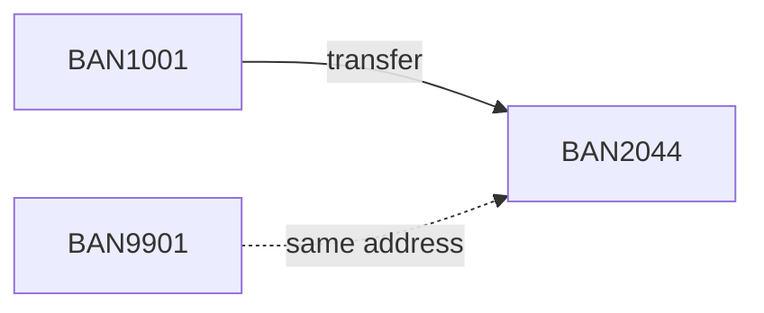
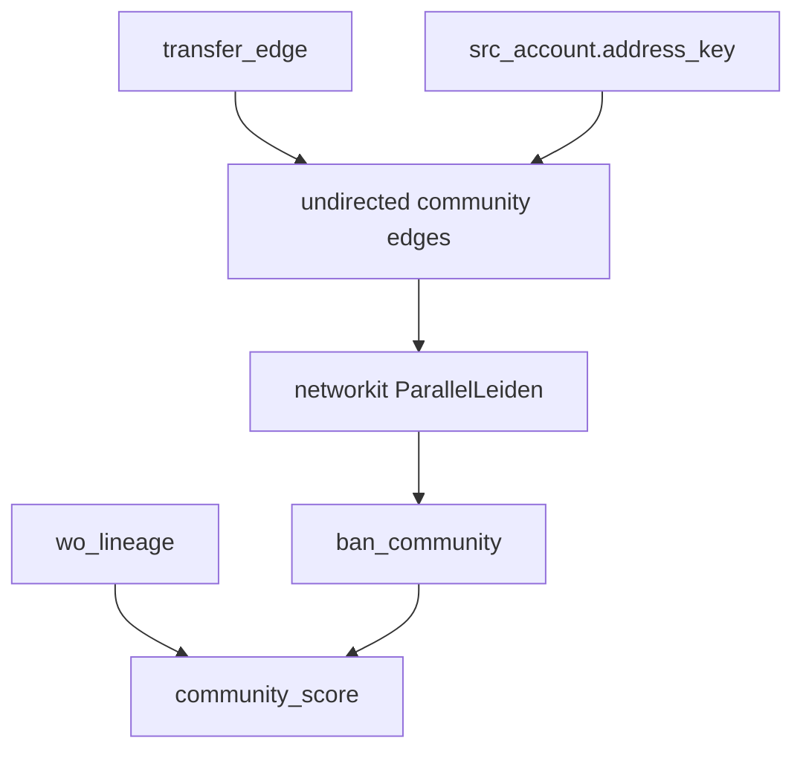

# Phase 5 Walkthrough

## Leiden communities on transfers plus shared address

**Goal.** Group BANs that belong together even when they did not all transfer directly to one another: transfer chains plus a conservative same-address link.

**Depends on.** `transfer_edge`, `ban_family`, `ban_centrality`, `wo_lineage`, `src_account` (address_key).

**Runtime.** NetworKit `ParallelLeiden` on an undirected BAN graph. DuckDB for edge construction and scoring.

**Exit criteria.**

- `ban_community` assigned  
- Each community scored on equipment WO, service WO if available, stacking rate, and agent mix  
- Address edges built from `address_key`, not ZIP  

---

## 1. Why communities after WCC

WCC only follows explicit transfers. Two BANs that never exchanged a CTN but share a normalized address can still be one ring or one household.



BAN9901 is invisible to Phase 2 if no CTN moved. Leiden on `TRANSFER ∪ SAME_ADDRESS` can attach it.

Do not treat a community as proof of fraud. Shared address is a household proxy in the absence of SSN.

---

## 2. Graph used in this phase

| Edge | Weight | Rule |
|---|---|---|
| TRANSFER | 2 | any CTN moved between the two BANs, undirected |
| SAME_ADDRESS | 1 | same `address_key`, two distinct BANs, key is not null and not a high-occupancy junk key |



ZIP is a property for reporting. ZIP is not an edge.

---

## 3. Build address keys carefully

If Phase 1 stored a raw address, normalize before edges.

```sql
-- Example only; replace with your standardizer
CREATE OR REPLACE TABLE g.ban_addr AS
SELECT
  ban,
  upper(regexp_replace(trim(address_key), '[^A-Z0-9]', '', 'g')) AS address_key,
  billing_zip AS zip
FROM src_account
WHERE address_key IS NOT NULL
  AND trim(address_key) <> '';
```

Drop keys that collide too often (apartments parsed badly, stores, “GENERAL DELIVERY”).

```sql
CREATE OR REPLACE TABLE g.addr_ban_counts AS
SELECT address_key, count(*) AS n_ban
FROM g.ban_addr
GROUP BY 1;

-- Review the tail before using it as edges
SELECT * FROM g.addr_ban_counts ORDER BY n_ban DESC LIMIT 50;
```

A working cap: do not emit SAME_ADDRESS edges for keys with more than 8 BANs unless you have confirmed they are real multi-account households. Storefront and dealer addresses will otherwise glue unrelated write-offs together.

```sql
CREATE OR REPLACE TABLE g.same_address_edge AS
SELECT
  least(a.ban, b.ban) AS ban_a,
  greatest(a.ban, b.ban) AS ban_b,
  a.address_key,
  'same_address' AS edge_type
FROM g.ban_addr a
JOIN g.ban_addr b
  ON a.address_key = b.address_key
 AND a.ban < b.ban
JOIN g.addr_ban_counts c
  ON c.address_key = a.address_key
 AND c.n_ban BETWEEN 2 AND 8;
```

---

## 4. Undirected community edge list

```sql
CREATE OR REPLACE TABLE g.community_edges AS
SELECT ban_a, ban_b, sum(weight) AS weight, max(edge_type) AS edge_type
FROM (
  SELECT
    least(from_ban, to_ban) AS ban_a,
    greatest(from_ban, to_ban) AS ban_b,
    2.0 AS weight,
    'transfer' AS edge_type
  FROM transfer_edge
  WHERE from_ban <> to_ban
  UNION ALL
  SELECT ban_a, ban_b, 1.0, edge_type
  FROM g.same_address_edge
)
GROUP BY 1, 2;

CREATE OR REPLACE TABLE g.community_nodes AS
SELECT ban, row_number() OVER (ORDER BY ban) - 1 AS c_idx
FROM (
  SELECT DISTINCT ban FROM (
    SELECT ban_a AS ban FROM g.community_edges
    UNION
    SELECT ban_b FROM g.community_edges
    UNION
    SELECT chargeoff_ban FROM wo_lineage
  )
);
```

Including charge-off BANs keeps singleton WO accounts in the node map even if they have no community edges. Leiden will leave them as size-1 communities.

---

## 5. Run ParallelLeiden

```python
import duckdb
import pandas as pd
import networkit as nk

con = duckdb.connect("your_extract.duckdb")
nodes = con.sql("SELECT ban, c_idx FROM g.community_nodes ORDER BY c_idx").df()
edges = con.sql("""
  SELECT s.c_idx AS src, d.c_idx AS dst, e.weight
  FROM g.community_edges e
  JOIN g.community_nodes s ON s.ban = e.ban_a
  JOIN g.community_nodes d ON d.ban = e.ban_b
""").df()

n = len(nodes)
g = nk.Graph(n, weighted=True, directed=False)
for r in edges.itertuples(index=False):
    g.addEdge(int(r.src), int(r.dst), float(r.weight))

leiden = nk.community.ParallelLeiden(g, iterations=3, randomize=True, gamma=1.0)
leiden.run()
part = leiden.getPartition()

comm = pd.DataFrame({
    "c_idx": range(n),
    "community_id": [int(part[i]) for i in range(n)],
})
out = nodes.merge(comm, on="c_idx")
sizes = out.groupby("community_id")["ban"].transform("size")
out["community_size"] = sizes.astype(int)

con.register("ban_community_df", out[["ban", "c_idx", "community_id", "community_size"]])
con.execute("CREATE OR REPLACE TABLE ban_community AS SELECT * FROM ban_community_df")
```

If NetworKit is unavailable in the environment, stop this phase rather than substituting NetworkX Louvain on a large graph. rustworkx does not provide a first-class Leiden you should depend on.

`gamma = 1.0` is the standard modularity resolution. If communities are huge and uninformative, raise gamma slightly (for example 1.2) and rerun once. Do not grid-search resolution against write-off rate; that overfits the target.

---

## 6. Target tables

### 6.1 `ban_community`

| ban | c_idx | community_id | community_size |
|---|---|---|---|
| BAN1001 | 1 | 14 | 5 |
| BAN2044 | 2 | 14 | 5 |
| BAN3309 | 3 | 88 | 1 |

### 6.2 `community_score`

```sql
CREATE OR REPLACE TABLE community_score AS
SELECT
  c.community_id,
  any_value(c.community_size) AS community_size,
  count(DISTINCT l.chargeoff_ban) AS n_wo_bans,
  sum(l.wo_amt) FILTER (WHERE l.window = 'current_12m') AS eq_wo_current,
  sum(l.wo_amt) FILTER (WHERE l.window = 'prior_12m')   AS eq_wo_prior,
  sum(l.wo_amt) FILTER (
    WHERE l.window = 'current_12m' AND l.path_type = 'new_eip_after_transfer'
  ) AS stack_wo_current,
  sum(l.wo_amt) FILTER (
    WHERE l.window = 'current_12m' AND l.path_type = 'moved_eip'
  ) AS moved_wo_current,
  count(DISTINCT l.agent_id) FILTER (
    WHERE l.window = 'current_12m' AND l.path_type = 'new_eip_after_transfer'
  ) AS n_agents_stacking
FROM ban_community c
LEFT JOIN wo_lineage l ON l.chargeoff_ban = c.ban
GROUP BY 1;
```

Add service write-off if you stored it on `src_account`:

```sql
-- optional control
SELECT
  c.community_id,
  sum(coalesce(a.service_wo_amt, 0)) AS service_wo_amt
FROM ban_community c
JOIN src_account a USING (ban)
GROUP BY 1;
```

The company-level symptom is high equipment WO with flat service WO. Communities that match that shape are the review set.

---

## 7. Review query

```sql
SELECT
  community_id,
  community_size,
  eq_wo_current,
  eq_wo_prior,
  eq_wo_current - eq_wo_prior AS delta,
  stack_wo_current,
  moved_wo_current,
  n_agents_stacking
FROM community_score
WHERE community_size >= 2
ORDER BY delta DESC
LIMIT 30;
```

Pull members of a community under review:

```sql
SELECT
  c.ban,
  c.community_size,
  f.family_id,
  f.family_size,
  h.in_degree,
  h.out_degree,
  h.eq_wo_amt_current,
  a.address_key,
  a.acq_channel
FROM ban_community c
JOIN ban_family f USING (ban)
LEFT JOIN ban_centrality h USING (ban)
LEFT JOIN src_account a USING (ban)
WHERE c.community_id = 14
ORDER BY h.eq_wo_amt_current DESC NULLS LAST;
```

---

## 8. How Phase 5 relates to Phase 2 families

```sql
SELECT
  count(*) AS bans,
  count(DISTINCT family_id) AS families,
  count(DISTINCT community_id) AS communities
FROM ban_community
JOIN ban_family USING (ban);
```

Typical pattern: communities ≥ families when address edges merge separate transfer components. If communities ≈ families, address added almost nothing and the TBR graph already captured the structure.

If one community swallows a huge share of all BANs, the address key is too coarse. Drop SAME_ADDRESS, rerun Leiden on transfers only, and treat address as a review attribute instead of an edge.

---

## 9. Validation

```sql
SELECT count(*) FILTER (WHERE community_id IS NULL) FROM ban_community;

SELECT community_id, count(*) AS n, any_value(community_size)
FROM ban_community
GROUP BY 1
HAVING count(*) <> any_value(community_size);
```

Both should be clean. Inspect the size distribution:

```sql
SELECT community_size, count(*) AS n_communities
FROM (SELECT community_id, any_value(community_size) AS community_size FROM ban_community GROUP BY 1)
GROUP BY 1
ORDER BY 1;
```

A single community with tens of thousands of BANs is a data-quality failure, not a nationwide ring.

---

## 10. Optional similarity watchlist (only after scoring)

Use neighborhood overlap on the community graph to flag *open* BANs that look like high-delta communities. This is not required to explain last year’s increase.

```sql
-- BANs in high-delta communities that are still active and have
-- inbound transfers in the last 180 days but no WO yet
SELECT
  c.ban,
  c.community_id,
  s.delta,
  a.account_status
FROM ban_community c
JOIN community_score s USING (community_id)
JOIN src_account a USING (ban)
WHERE s.delta > 0
  AND a.account_status = 'ACTIVE'
  AND c.ban NOT IN (SELECT chargeoff_ban FROM wo_lineage)
  AND EXISTS (
    SELECT 1 FROM transfer_edge e
    WHERE e.to_ban = c.ban
      AND e.transfer_dt >= current_date - INTERVAL '180 days'
  );
```

That list is an investigation queue, not a scorecard.

---

## 11. What Phase 5 does not build

- A Person node  
- ZIP edges  
- Resolution-parameter search against WO rate  
- Real-time monitoring  

---

## 12. Deliverables

1. `ban_community`  
2. `community_score`  
3. Top communities by dollar increase  
4. Member extract for the top communities  
5. Note on whether address edges merged families or created a giant component  

Phase 6 consumes these lists plus `wo_lineage` and writes the findings memo.
