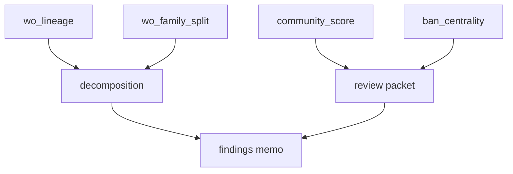

# Phase 6 Walkthrough

## Year-over-year synthesis, review packet, and findings memo

**Goal.** Turn Phases 1–5 into a dollar explanation of the equipment write-off increase and a short list of objects for credit, fraud, and channel partners to review.

**Depends on.** `wo_lineage`, `wo_family_split`, `ban_centrality`, `community_score`, `installment_fact`.

**No new graph algorithm.** This phase is SQL, concentration checks, and writing.

**Exit criteria.**

- A complete YoY decomposition table  
- A ranked review packet (communities, hubs, agents, paths)  
- A findings memo that states what caused the increase, what did not, and what remains unexplained  

---

## 1. What “done” means

Finance will not accept PageRank. They will accept:

1. Equipment write-off dollars this year versus last year  
2. Which path types and families absorbed the change  
3. Whether that change is broad or concentrated  
4. Whether service write-offs stayed flat inside the same cuts  



---

## 2. Canonical decomposition

Run these cuts in order. Each cut is a separate table. Do not cross every attribute at once.

```sql
CREATE OR REPLACE VIEW g.decomp_path AS
SELECT
  path_type,
  sum(wo_amt) FILTER (WHERE window = 'current_12m') AS current_amt,
  sum(wo_amt) FILTER (WHERE window = 'prior_12m')   AS prior_amt,
  sum(wo_amt) FILTER (WHERE window = 'current_12m')
    - sum(wo_amt) FILTER (WHERE window = 'prior_12m') AS delta_amt
FROM wo_lineage
GROUP BY 1;

CREATE OR REPLACE VIEW g.decomp_family AS
SELECT
  is_transfer_family,
  sum(wo_amt) FILTER (WHERE window = 'current_12m') AS current_amt,
  sum(wo_amt) FILTER (WHERE window = 'prior_12m')   AS prior_amt,
  sum(wo_amt) FILTER (WHERE window = 'current_12m')
    - sum(wo_amt) FILTER (WHERE window = 'prior_12m') AS delta_amt
FROM wo_lineage
GROUP BY 1;

CREATE OR REPLACE VIEW g.decomp_eq AS
SELECT
  path_type,
  eq_type,
  sum(wo_amt) FILTER (WHERE window = 'current_12m') AS current_amt,
  sum(wo_amt) FILTER (WHERE window = 'prior_12m')   AS prior_amt,
  sum(wo_amt) FILTER (WHERE window = 'current_12m')
    - sum(wo_amt) FILTER (WHERE window = 'prior_12m') AS delta_amt
FROM wo_lineage
GROUP BY 1, 2;

CREATE OR REPLACE VIEW g.decomp_channel AS
SELECT
  path_type,
  channel,
  sum(wo_amt) FILTER (WHERE window = 'current_12m') AS current_amt,
  sum(wo_amt) FILTER (WHERE window = 'prior_12m')   AS prior_amt,
  sum(wo_amt) FILTER (WHERE window = 'current_12m')
    - sum(wo_amt) FILTER (WHERE window = 'prior_12m') AS delta_amt
FROM wo_lineage
GROUP BY 1, 2;

CREATE OR REPLACE VIEW g.decomp_hops AS
SELECT
  path_type,
  CASE
    WHEN hop_count = 0 THEN '0'
    WHEN hop_count = 1 THEN '1'
    ELSE '2plus'
  END AS hop_band,
  sum(wo_amt) FILTER (WHERE window = 'current_12m')
    - sum(wo_amt) FILTER (WHERE window = 'prior_12m') AS delta_amt
FROM wo_lineage
GROUP BY 1, 2;

CREATE OR REPLACE VIEW g.decomp_lag AS
SELECT
  CASE
    WHEN days_last_xfer_to_orig IS NULL THEN 'n_a'
    WHEN days_last_xfer_to_orig < 30 THEN '0_29'
    WHEN days_last_xfer_to_orig < 90 THEN '30_89'
    ELSE '90_plus'
  END AS orig_lag,
  sum(wo_amt) FILTER (WHERE window = 'current_12m')
    - sum(wo_amt) FILTER (WHERE window = 'prior_12m') AS delta_amt
FROM wo_lineage
WHERE path_type = 'new_eip_after_transfer'
GROUP BY 1;
```

Sample shape of `g.decomp_path`:

| path_type | current_amt | prior_amt | delta_amt |
|---|---|---|---|
| new_eip_after_transfer | 9800000 | 3100000 | 6700000 |
| moved_eip | 5400000 | 4800000 | 600000 |
| singleton | 17900000 | 18200000 | -300000 |
| new_eip_on_transfer_family | 2100000 | 1900000 | 200000 |
| ambiguous | 400000 | 350000 | 50000 |

Read **delta**, not current level. Transfers can be common in the stock and still not cause the increase.

---

## 3. Concentration tests

An increase that lives in 12 communities or 8 agents is an operations problem. An increase spread across thousands of size-2 families is a policy or product problem.

```sql
CREATE OR REPLACE VIEW g.concentration AS
WITH comm AS (
  SELECT
    community_id,
    eq_wo_current - eq_wo_prior AS delta
  FROM community_score
),
tot AS (
  SELECT sum(delta) AS all_delta FROM comm
)
SELECT
  'top_10_communities' AS slice,
  sum(delta) FILTER (
    WHERE community_id IN (
      SELECT community_id FROM comm ORDER BY delta DESC LIMIT 10
    )
  ) / nullif((SELECT all_delta FROM tot), 0) AS share_of_community_delta
FROM comm;
```

Repeat for agents on stacking:

```sql
SELECT
  agent_id,
  channel,
  sum(wo_amt) FILTER (WHERE window = 'current_12m')
    - sum(wo_amt) FILTER (WHERE window = 'prior_12m') AS delta_amt
FROM wo_lineage
WHERE path_type = 'new_eip_after_transfer'
GROUP BY 1, 2
ORDER BY 3 DESC
LIMIT 20;
```

If the top 10 agents hold most of the stacking increase, the memo should say so. Graph structure then becomes supporting context, not the headline.

---

## 4. Service write-off control

The original symptom is equipment up, service flat. Replicate that cut inside transfer families.

```sql
SELECT
  f.is_transfer_family,
  sum(coalesce(a.service_wo_amt, 0)) AS service_wo_amt
FROM src_account a
JOIN ban_family f USING (ban)
GROUP BY 1;
```

If you only have service WO dates, build prior vs current the same way as equipment. A transfer-family equipment spike with flat service inside those families matches the company-level pattern. A parallel service spike would argue general credit deterioration, which you have already ruled out at the portfolio level but should still check inside the graph slice.

---

## 5. Review packet

Produce four extracts. Keep them small enough to read.

### 5.1 Communities

Top 20 by `delta` from `community_score`, with size, stacking dollars, moved-EIP dollars, agent count.

### 5.2 Collector BANs

From `ban_centrality`, current WO > 0 and in_degree ≥ 2, top 50 by current WO. Attach dominant `path_type`.

```sql
SELECT
  h.ban,
  h.family_id,
  h.community_id,
  h.in_degree,
  h.pagerank_wo,
  h.eq_wo_amt_current,
  mode(l.path_type) AS main_path_type
FROM ban_centrality h
LEFT JOIN ban_community USING (ban)
JOIN wo_lineage l ON l.chargeoff_ban = h.ban
WHERE h.in_degree >= 2
GROUP BY 1, 2, 3, 4, 5, 6
ORDER BY 6 DESC
LIMIT 50;
```

`mode()` exists in DuckDB. If not, use `arg_max(path_type, wo_amt)` after a path_type sum.

### 5.3 Agents

Top 20 agents on `new_eip_after_transfer` delta.

### 5.4 Example paths

Twenty `wo_lineage` rows from the cell that holds the most increase. These are narrative examples, not a sample for statistics.

```sql
SELECT *
FROM wo_lineage
WHERE path_type = 'new_eip_after_transfer'
  AND window = 'current_12m'
ORDER BY wo_amt DESC
LIMIT 20;
```

---

## 6. How to interpret the memo

| Evidence | Statement you can make |
|---|---|
| Transfer-family delta dominates, path_type = `new_eip_after_transfer`, lag 0–29 days | Increase is post-TBR equipment stacking on destination accounts |
| Transfer-family delta dominates, path_type = `moved_eip` | Increase is transferred installment balances that later charged off |
| Watch/tablet share of stacking delta is disproportionate | Device-class mix on destination adds, not phones alone |
| Top 10 communities or agents hold most of the delta | Concentrated process or dealer problem |
| Singleton delta dominates | TBR is not the driver; stop the graph story |
| Transfer-linked *level* is high but delta is not | Transfers are common among write-offs; they did not cause the increase |
| Service WO also rose inside the same families | Broader destination credit quality, not equipment-only gaming |

Use one primary statement. Secondary cuts support it. Do not list every algorithm as a finding.

---

## 7. Findings memo outline

Keep this to two pages.

1. **Question.** What caused the year-over-year increase in equipment write-offs, given flat service write-offs and no loosening of credit policy?  
2. **Method in one paragraph.** Occupancy-derived transfers, account families (WCC), installment lineage, hub scores, Leiden on transfer + address.  
3. **Headline dollar table.** `g.decomp_path` and `g.decomp_family`.  
4. **Concentration.** Share of delta in top communities and top agents.  
5. **What is not supported.** Credit loosening (already vetted). Singleton origination, if the data say so. Address-only giant components, if Phase 5 rejected them.  
6. **Residual.** Ambiguous lineage, missing TBR request labels, recoveries not netted.  
7. **Ask of operations.** Review the packet in §5. Do not score customers in production from these labels.

---

## 8. What not to ship

- A real-time model  
- A “fraud score” column on every BAN  
- Community IDs as collections treatment  
- Household TBR examples without the control flags from Phase 3  

If operations wants an ongoing monitor, that is a later project. It would reuse `transfer_edge` and the `new_eip_after_transfer` rule, not Leiden on a nightly full graph.

---

## 9. File checklist

| File | Phase |
|---|---|
| `Phase1_Occupancy_and_Transfer_Edges.md` | Edge construction |
| `Phase2_WCC_Family_Measurement.md` | Family measurement / stop-go |
| `Phase3_Installment_Lineage.md` | Path types |
| `Phase4_Centrality_Hubs.md` | Collectors and senders |
| `Phase5_Communities_Leiden.md` | Rings |
| This file | Attribution and memo |

Working tables that should exist at the end:

`subscriber_occupancy`, `transfer_edge`, `installment_fact`, `ban_map`, `ban_family`, `wo_lineage`, `ban_centrality`, `ban_community`, `community_score`.

---

## 10. Immediate close-out queries

```sql
SELECT 'path' AS cut, * FROM g.decomp_path
UNION ALL BY NAME
SELECT 'family', is_transfer_family::VARCHAR, current_amt, prior_amt, delta_amt FROM g.decomp_family;

SELECT * FROM g.decomp_eq ORDER BY delta_amt DESC;
SELECT * FROM g.decomp_lag ORDER BY 1;
```

`UNION ALL BY NAME` requires recent DuckDB. If it fails, run the views separately.

Write the memo from those three result sets plus the top-10 community share. That is the end of the project as scoped.
